|            | Algorithm and Data Structure                                              |
| ---------- | ------------------------------------------------------------------------- |
| NIM        | 244107020028                                                              |
| Nama       | Muhammad Aryatama Mukapraja                                               |
| Kelas      | TI - 1H                                                                   |
| Repository | [link] (https://github.com/MuhammadAryatamaM/Algoritma-dan-Struktur-Data) |

# Jobhseet #1 Konsep Dasar Pemrograman

## 2.2.1. Solusi Praktikum Pemilihan

Solusi ada di PemilihanNilaiAkhir.java, dan berikut screenshot hasilnya

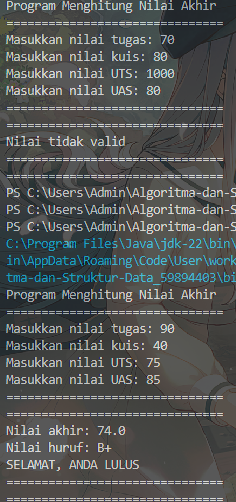
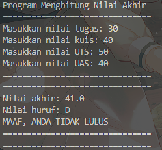

**Penjelasan singkat:**

#### Ada 4 langkah utama:

1. Input semua nilai
2. Hitung nilai akhir
3. Menentukan nilai huruf berdasarkan nilai akhir
4. Validasi nilai, jika valid maka tampilkan status kelulusan

## 2.3.1. Solusi Praktikum Perulangan

Solusi ada di PerulanganAngkaDanAsterisk.java, dan berikut screenshot hasilnya

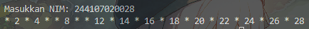

**Penjelasan singkat:**

#### Ada 3 langkah utama:

1. Input NIM dalam bentuk String
2. Ambil 2 digit terakhir dengan substring lalu konversi ke integer dengan parseInt. Jika 2 digit itu kurang dari 10, maka tambah dengan 10
3. Lakukan perulangan dari 1 sampai 2 digit akhir. Jika sudah di perulangan ke 6 atau 10, continue. Jika angka modulus 2 = 0, tampilkan angka tersebut. Jika angka modulus 2 =/= 0, tampilkan ' \* '

## 2.4.1. Solusi Praktikum Array

Solusi ada di ArraySKSSemester.java, dan berikut screenshot hasilnya

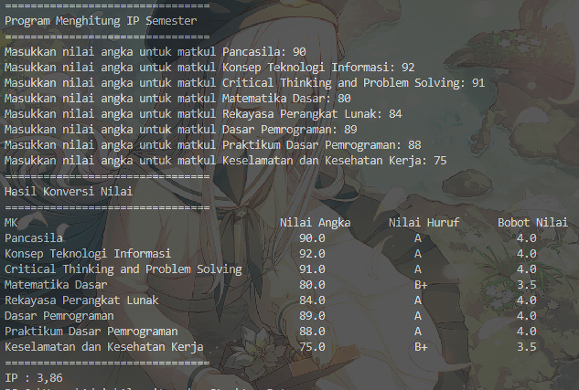

**Penjelasan singkat:**

#### Ada 4 langkah utama:

1. Buat array untuk tiap data:

- Nama matkul (String[])
- SKS matkul (double[]), dengan SKSnya menyesuaikan indeks tiap matkul
- Nilai huruf (String[])
- Nilai setara (double[])
- Nilai awal serta bobot nilai (nilai[][])

2. Input nilai awal tiap matkul serta menentukan nilai huruf dan setaranya. Jika tidak valid, break
3. Hitung bobot nilai, tambahkan semua, bagi dengan total SKS, didapat IP Semester
4. Tampilkan nama matkul, nilai huruf, nilai setara, dan IP Semester

## 2.5.1. Solusi Praktikum Fungsi

Solusi ada di FungsiStokBunga.java, dan berikut screenshot hasilnya

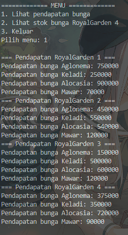
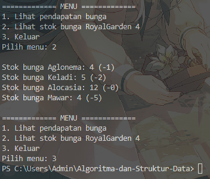

**Penjelasan singkat:**

#### Ada 3 langkah utama:

1. Buat array untuk tiap data:

- Nama bunga (String[])
- Harga bunga (int[]), dengan harganya menyesuaikan indeks tiap bunga
- Stok bunga (int[][])
- Hasil pendapatan bunga (int[][])

2. Menampilkan menu, jika memilih 1, masuk fungsi pendapatan bunga:  
   2.1.1. Lakukan perulangan level 2 yaitu menghitung pendapatan bunga serta menampilkannya  
   2.1.2. Lakukan perulangan level 1 yaitu untuk tiap cabang   
   Jika memilih 2, masuk fungsi lihat stok bunga:  
   2.2.1. Lakukan perulangan dengan tiap indeks bunga akan dikurangi nilai tertentu  
   2.2.2. Tampilkan stok bunga setelah dikurangi  
3. Keluar program dengan memilih 3

## 3.1. Solusi Tugas 1

Solusi ada di TugasPlatNomor.java, dan berikut screenshot hasilnya

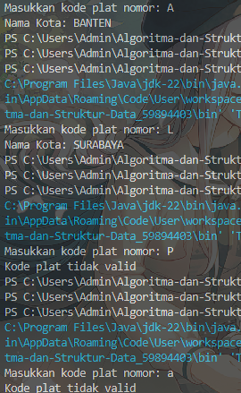

**Penjelasan singkat:**

#### Ada 4 langkah utama:

1. Buat array untuk tiap data:

- Kode (char[])
- Kota (char[][]), dengan kotanya menyesuaikan indeks tiap kode

2. Input kode
3. Cari kodenya ada di array kode atau tidak, jika tidak, tampilkan kode tidak valid
4. Tiap kode akan mempunyai nilai sesuai indeksnya, dan perulangan kota[][] dilakukan sesuai indeks kode untuk membentuk suatu kata berupa nama kota

## 3.2. Solusi Tugas 2

Solusi ada di TugasRumusKubus.java, dan berikut screenshot hasilnya

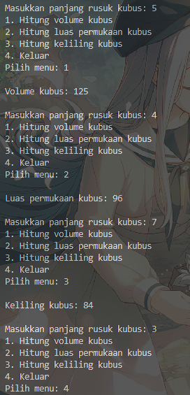

**Penjelasan singkat:**

#### Ada 4 langkah utama:

1. Input panjang rusuk kubus

2. Menampilkan menu, jika memilih 1, masuk fungsi volume kubus:  
   2.1.1. Hitung rumus volume kubus dengan rusuk sebagai parameter  
   2.1.2. Nilai volume dikembalikan  
   Jika memilih 2, masuk fungsi luas permukaan kubus:  
   2.2.1. Hitung rumus luas permukaan kubus dengan rusuk sebagai parameter  
   2.2.2. Nilai luas permukaan dikembalikan  
   Jika memilih 3, masuk fungsi keliling kubus:  
   2.3.1. Hitung rumus keliling kubus dengan rusuk sebagai parameter  
   2.3.2. Nilai keliling dikembalikan 
3. Tampilkan hasil sesuai nilai yang dikembalikan
4. Keluar program dengan memilih 4

## 3.3. Solusi Tugas 3

Solusi ada di TugasJadwalMatkul.java, dan berikut screenshot hasilnya

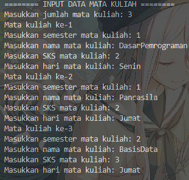
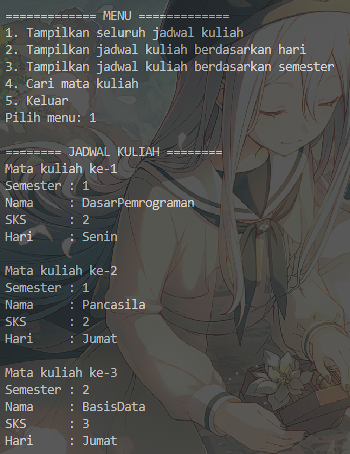
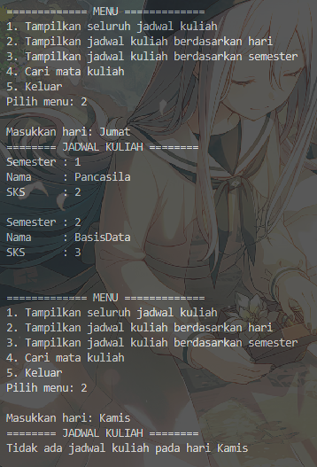
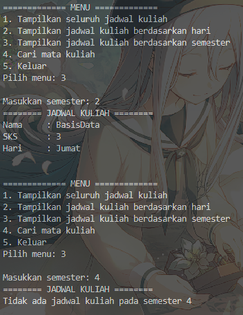
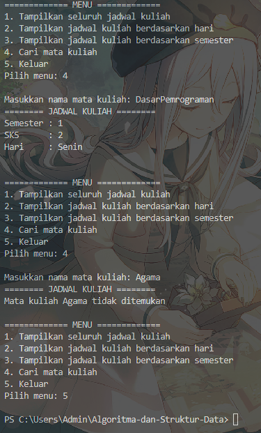

**Penjelasan singkat:**

#### Ada 3 langkah utama:

1. Input jumlah matkul yang akan digunakan untuk panjang tiap array untuk data:

- Nama matkul (String[])
- Hari matkul (String[])
- SKS matkul (int[])
- Semester matkul (int[])

2. Input seluruh data, lalu menampilkan menu, jika memilih 1, akan menampilkan seluruh jadwal:  
   2.1.1. Perulangan untuk menampilkan seluruh data menggunakan array dengan indeks yang sama semua 

   Jika memilih 2, akan menampilkan jadwal berdasarkan hari:  
   2.2.1. Input hari  
   2.2.2. Perulangan untuk cek seluruh indeks yang mempunyai hari yang sama sesuai input. Jika ada, tampilkan datanya dan mengubah boolean untuk cek ketersediaan menjadi true. Jika sampai indeks terakhir dan boolean masih false, tampilkan data tidak ada  

   Jika memilih 3, akan menampilkan jadwal berdasarkan semester:  
   2.3.1. Input semester  
   2.3.2. Perulangan untuk cek seluruh indeks yang mempunyai semester yang sama sesuai input. Jika ada, tampilkan datanya dan mengubah boolean untuk cek ketersediaan menjadi true. Jika sampai indeks terakhir dan boolean masih false, tampilkan data tidak ada 

   Jika memilih 4, akan menampilkan jadwal berdasarkan nama mata kuliah:  
   2.4.1. Input nama mata kuliah  
   2.4.2. Perulangan untuk cek seluruh indeks yang mempunyai nama yang sama sesuai input. Jika ada, tampilkan datanya dan mengubah boolean untuk cek ketersediaan menjadi true. Jika sampai indeks terakhir dan boolean masih false, tampilkan data tidak ada  

3. Keluar program dengan memilih 5
