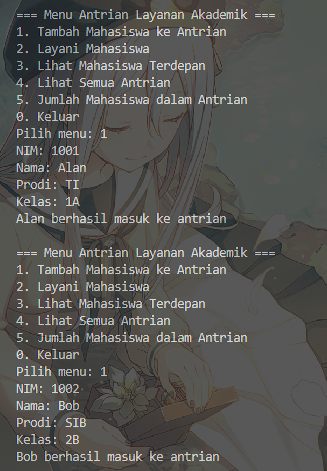

|            | Algorithm and Data Structure                                              |
| ---------- | ------------------------------------------------------------------------- |
| NIM        | 244107020028                                                              |
| Nama       | Muhammad Aryatama Mukapraja                                               |
| Kelas      | TI - 1H                                                                   |
| Repository | [link] (https://github.com/MuhammadAryatamaM/Algoritma-dan-Struktur-Data) |

# Jobhseet #10 Queue

## Percobaan 1: Operasi Dasar Queue

### 10.2.2. Verifikasi Hasil Percobaan

Berikut hasil screenshot dari `QueueMain15.java`:


### 10.2.3 Jawaban Pertanyaan

1. Pada konstruktor, mengapa nilai awal atribut `front` dan `rear` bernilai `-1`, sementara atribut `size` bernilai `0`? <p>
   Jawab: `front` dan `rear` diberi `-1` agar tidak 'melabeli' indeks apapun di array, dan `size` diberi `0` agar menandakan tidak ada data di array (masih kosong)
2. Pada method **Enqueue**, jelaskan maksud dan kegunaan dari potongan kode berikut! <p>
   ```
   if (rear == max - 1) rear = 0;
   ```
   Jawab: Saat menambahkan data, cek posisi rear sekarang. Jika posisinya sudah di indeks terakhir array, maka rear dilabeli ke indeks 0 (balik ke awal)
3. Pada method **Dequeue**, jelaskan maksud dan kegunaan dari potongan kode berikut!
   ```
   if (front == max - 1) front = 0;
   ```
   Jawab: Saat menghapus data, cek posisi front sekarang. Jika posisinya sudah di indeks terakhir array, maka front dilabeli ke indeks 0 (balik ke awal)
4. Pada method **print**, mengapa pada proses perulangan variabel `i` tidak dimulai dari `0 (int i = 0)`, melainkan `int i = front`? <p>
   Jawab: Karena `front` tidak selalu dari indeks `0`
5. Perhatikan kembali method **print**, jelaskan maksud dari potongan kode berikut! <p>
   ```
   i = (i + 1) % max;
   ```
   Jawab: Rumus tersebut akan menentukan data akan ditunjuk di indeks (`i`) mana, dengan mempertimbangkan kalau `rear` bisa lebih kecil dari `front`. Jadi jika `max = 6` dan `i = 5` (indeks terakhir array), maka data selanjutnya akan menunjuk `i = 6 % 6 = 0` (balik ke awal) dan berlanjut `i = 1 % 6 = 1` sampai `rear`
6. Tunjukkan potongan kode program yang merupakan queue overflow! <p>
   Jawab:

   ```
   if (isFull()) System.out.println("Queue sudah penuh.");
   ```

7. Pada saat terjadi queue overflow dan queue underflow, program tersebut tetap dapat berjalan dan hanya menampilkan teks informasi. Lakukan modifikasi program sehingga pada saat terjadi queue overflow dan queue underflow, program dihentikan!
   Jawab:

   ```
   public void enqueue(int dt) {
      if (isFull()) {
         System.out.println("Queue sudah penuh.");
         System.exit(0);
      }
      else {
         if (isEmpty()) front = rear = 0;
         else {
            if (rear == max - 1) rear = 0;
            else rear++;
         }
         data[rear] = dt;
         size++;
      }
   }

   public int dequeue() {
      int dt = 0;
      if (isEmpty()) {
         System.out.println("Queue masih kosong.");
         System.exit(0);
      }
      else {
         dt = data[front];
         size--;
         if (isEmpty()) front = rear = -1;
         else {
            if (front == max -1) front = 0;
            else front++;
         }
      }
      return dt;
   }
   ```

## Percobaan 2: Antrian Layanan Akademik

### 10.3.2. Verifikasi Hasil Percobaan

Berikut hasil screenshot dari `LayananAkademikSIAKAD15.java`:

 <br>
 <br>


### 10.3.3. Jawaban Pertanyaan

1. Lakukan modifikasi program dengan menambahkan method baru bernama **LihatAkhir** pada class **AntrianLayanan15** yang digunakan untuk mengecek antrian yang berada di posisi belakang. Tambahkan pula daftar menu **6**. Cek Antrian paling belakang pada class **LayananAkademikSIAKAD15** sehingga method **LihatAkhir** dapat dipanggil! <p>
   Jawab:

   ```
   public void lihatAkhir() {
        if (isEmpty()) System.out.println("Antrian kosong.");
        else {
            System.out.print("Mahasiswa terakhir: ");
            System.out.println("NIM - NAMA - PRODI - KELAS");
            data[rear].tampilkanData();
        }
    }
   ```

## 10.4.1. Solusi Latihan Praktikum KRS

Solusi ada di `AntrianKRS15.java`, `LayananKRS15.java`, dan `Mahasiswa15.java`, dan berikut screenshot hasilnya

 <br>
 <br>
 <br>
 <br>
 <br>


**Penjelasan singkat:**

#### Pada Mahasiswa15.java ada 2 langkah utama:

1. Deklarasi atribut dan konstruktor berparameter tiap atribut
2. Untuk method `tampilkanData`: Print tiap atribut

#### Pada AntrianKRS15.java ada 13 langkah utama:

1. Deklarasi array `data` berukuran `10` dengan tipe data `Mahasiswa15` dan atribut `front`, `rear`, `size`, `max`, dan `sudahDiproses`
2. Buat konstruktor berparameter `n` dengan mengisi `max = n`, `data[]` berukuran `n`, `front, size, sudahDiproses = 0`, dan `rear = -1`
3. Untuk method `isEmpty`: Return boolean `top == -1`
4. Untuk method `isFull`: Return boolean `top == size - 1`
5. Untuk method `tambahAntrian`: Jika queue tidak penuh, tentukan posisi `rear` dari `rear = (rear + 1) % max;` lalu masukkan objek `Mahasiswa15` ke `data[rear]` dan tambah `size` dengan 1
6. Untuk method `layaniMahasiswa`: Jika kosong, return `null`. Jika tidak, simpan sementara objek yang ada di `data[front]` ke `mhs`, update `front` dengan `front = (front + 1) % max;`, kurang `size` dengan 1 dan tambah `sudahDiproses` dengan 1.
7. Untuk method `lihatDuaTerdepan`: Jika queue kosong, print "Antrian kosong". Jika tidak, print `data[front]`. Untuk mahasiswa kedua, jika tidak ada (cek dari `size != 1`) print "Tidak ada mahasiswa lagi", kalau ada, cek apakah `front + 1` melebihi kapasitas array atau tidak. Jika iya, print `data[0]`, jika tidak print `data[front + 1]`
8. Untuk method `lihatTerbelakang`: Jika queue kosong, print "Antrian kosong". Jika tidak, print `data[rear]`
9. Untuk method `tampilkanSemua`: Jika queue kosong, print "Antrian kosong". Jika tidak, mulai perulangan `i < size` dari `i = 0`. Ambil indeks antrian dengan `index = (front + i) % max` lalu print `data[index]`
10. Untuk method `lihatTerbelakang`: Jika queue kosong, print "Queue masih kosong". Jika tidak, set `size = 0` dan `front = rear = -1` untuk menghilangkan labelnya
11. Untuk method `getJumlahAntrian`: Return `size`
12. Untuk method `jumlahSudahDiproses`: Return `sudahDiproses`
13. Untuk method `jumlahBelumDiproses`: Return `30 - sudahDiproses`

#### Pada LayananKRS15.java ada 10 langkah utama:

1. Instansiasi objek `antrian` bertipe `AntrianKRS15` dengan ukuran `10` dan buat while loop selama `pilihan != 0` untuk menu
2. Menu 1 (Tambah Mahasiswa ke Antrian): Input tiap atribut `Mahasiswa15` ke variabel lalu buat objek baru `mhs` dengan parameter tiap atribut yang sudah diinput. Masukkan `mhs` ke stack dengan **tambahAntrian(mhs)**
3. Menu 2 (Layani 2 Mahasiswa): Loop 2x. Ambil antrian terdepan dengan **layaniMahasiswa()** dan simpan ke `dilayani`. Jika `dilayani != null`, print data `dilayani`
4. Menu 3 (Lihat Semua Antrian): Panggil **tampilkanSemua()**
5. Menu 4 (Lihat 2 Mahasiswa Paling Depan): Panggil **lihatDuaTerdepan()**
6. Menu 5 (Lihat Mahasiswa Paling Belakang): Panggil **lihatTerbelakang()**
7. Menu 6 (Kosongkan Antrian): Panggil **clear()**
8. Menu 7 (Jumlah Mahasiswa dalam Antrian): Panggil **getJumlahAntrian()**
9. Menu 8 (Jumlah Mahasiswa yang Sudah Melakukan Proses KRS): Panggil **jumlahSudahDiproses()**
10. Menu 9 (Jumlah Mahasiswa yang Belum Melakukan Proses KRS): Panggil **jumlahBelumDiproses()**
