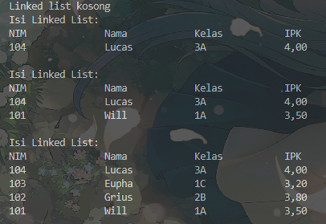
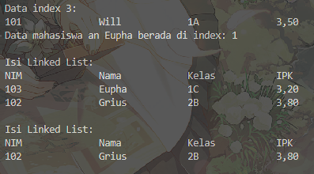
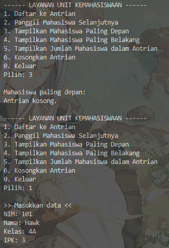
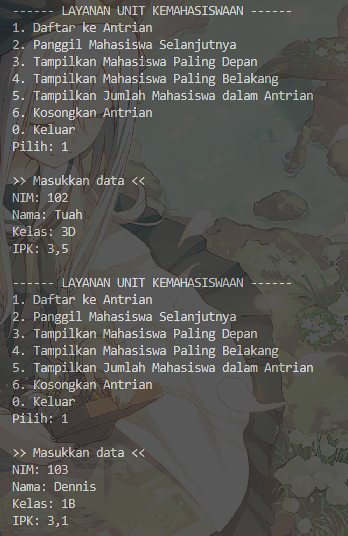
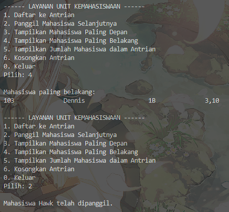
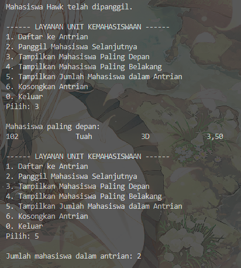
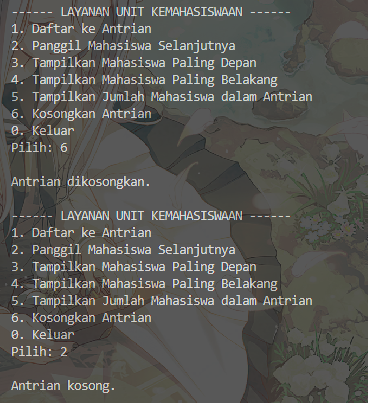

|            | Algorithm and Data Structure                                              |
| ---------- | ------------------------------------------------------------------------- |
| NIM        | 244107020028                                                              |
| Nama       | Muhammad Aryatama Mukapraja                                               |
| Kelas      | TI - 1H                                                                   |
| Repository | [link] (https://github.com/MuhammadAryatamaM/Algoritma-dan-Struktur-Data) |

# Jobhseet #11 Linked List

## Percobaan 1: Pembuatan Single Linked List

### 11.2.2. Verifikasi Hasil Percobaan

Berikut hasil screenshot dari `SLLMain15.java`:



### 11.2.3 Jawaban Pertanyaan

1. Mengapa hasil compile kode program di baris pertama menghasilkan “Linked List Kosong”? <p>
   Jawab: Karena Linked List belum diisi apa apa
2. Jelaskan kegunaan variable temp secara umum pada setiap method! <p>
   Jawab: Sebagai label yang digunakan untuk berpindah pindah antar ikatan tanpa memindah `head`
3. Lakukan modifikasi agar data dapat ditambahkan dari keyboard! <p>
   Jawab: Buat method **input()**:

   ```
   public static Mahasiswa15 input() {
        Scanner sc = new Scanner(System.in);
        System.out.print("NIM: ");
        String nim = sc.nextLine();
        System.out.print("Nama: ");
        String nama = sc.nextLine();
        System.out.print("Kelas: ");
        String kelas = sc.nextLine();
        System.out.print("IPK: ");
        double ipk = sc.nextDouble();
        return new Mahasiswa15(nim, nama, kelas, ipk);
    }
   ```

   Ganti tiap method memasukkan data dengan **input()**, seperti:

   ```
   sll.addFirst(input());
   sll.addLast(input());
   sll.insertAfter("Lucas", input());
   sll.insertAt(2, input());
   ```

## Percobaan 2: Modifikasi Elemen pada Single Linked List

### 11.3.2. Verifikasi Hasil Percobaan

Berikut hasil screenshot dari `SLLMain15.java`:



### 11.3.3. Jawaban Pertanyaan

1. Mengapa digunakan keyword break pada fungsi remove? Jelaskan! <p>
   Jawab: Agar saat ketemu data yang ingin dihapus langsung selesai
2. Jelaskan kegunaan kode dibawah pada method remove!
   ```
   tmp.next = tmp.next.next;
   if (tmp.next == null) tail = tmp;
   ```
   Jawab: Saat menghapus data, posisi sedang di `tmp`, dan yang dihapus ada di posisi `tmp.next`. Agar bisa menghapus `tmp.next`, `tmp.next` diganti dengan `tmp.next.next` agar `tmp` dan `tmp.next.next` tetap terikat

## 11.4.1. Solusi Latihan Praktikum Antrian SLL

Solusi ada di `AntrianDemo15.java` dan `AntrianMahasiswa15.java` dan berikut screenshot hasilnya

 <br>
 <br>
 <br>
 <br>


**Penjelasan singkat:**

#### Pada AntrianMahasiswa15.java ada 9 langkah utama:

1. Deklarasi `head` untuk `node` dan atribut `size` dan `max` untuk queue. Buat konstruktur berparameter `max` untuk ukuran queue dan deklarasi `size = 0`
2. Untuk method `isEmpty`: Return boolean `size == 0`
3. Untuk method `isFull`: Return boolean `size == max`
4. Untuk method `clear`: Ubah `head` jadi `null` dan `size` jadi `0`
5. Untuk method `enqueue`: Jika queue tidak penuh, masukkan `node` dengan dari input user ke variabel `ndInput`. Jika merupakan antrian pertama, assign `ndInput` sebagai `head`, jika tidak, simpan sementara nilai `ndInput` ke `tmp` dan loop sampai node terakhir, lalu assign `tmp.next` sebagai `ndInput`. Tambah `size` dengan 1
6. Untuk method `dequeue`: Jika kosong, return `null`. Jika tidak, simpan sementara nilai `head` ke `tmp`. Jika hanya ada 1 node, jadikan `head == null`, jika tidak, ambil `head` lalu diganti ke `head.next`. Kurang `size` dengan 1 dan return `tmp.data`
7. Untuk method `getFirst`: Jika queue kosong, print "Antrian kosong". Jika tidak, ambil tampilkan informasi dari `data` di `head`
8. Untuk method `getLast`: Jika queue kosong, print "Antrian kosong". Jika tidak, simpan sementara nilai `head` ke `tmp` dan loop sampai node terakhir, lalu tampilkan informasi `data` di `tmp`
9. Untuk method `getJumlahMhs`: Return `size`

#### Pada AntrianDemo15.java ada 7 langkah utama:

1. Instansiasi objek `sll` bertipe `AntrianMahasiswa15` dengan ukuran `3` dan buat while loop untuk menu
2. Menu 1 (Daftar ke Antrian): Input tiap atribut `Mahasiswa15` ke variabel lalu buat objek baru `mhs` dengan parameter tiap atribut yang sudah diinput. **enqueue** objek yang dibuat dengan parameter tiap atribut yang baru diiputkan
3. Menu 2 (Panggil Mahasiswa Selanjutnya): Ambil antrian terdepan dengan **dequeue** dan simpan ke `dequeued`. Jika `dequeued != null`, print nama `dequeued`
4. Menu 3 (Tampilkan Mahasiswa Paling Depan): Panggil **getFirst()**
5. Menu 4 (Tampilkan Mahasiswa Paling Belakang): Panggil **getLast()**
6. Menu 5 (Tampilkan Jumlah Mahasiswa dalam Antrian): Panggil **getJumlahMhs()**
7. Menu 6 (Kosongkan Antrian): Panggil **clear()**
