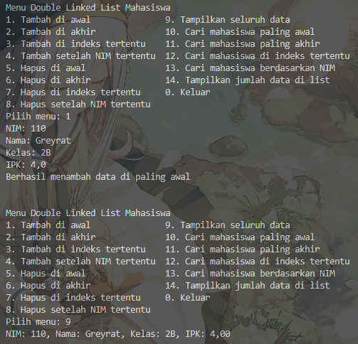
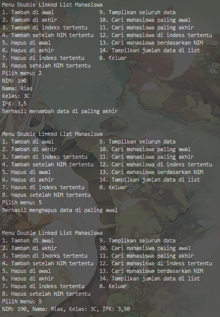
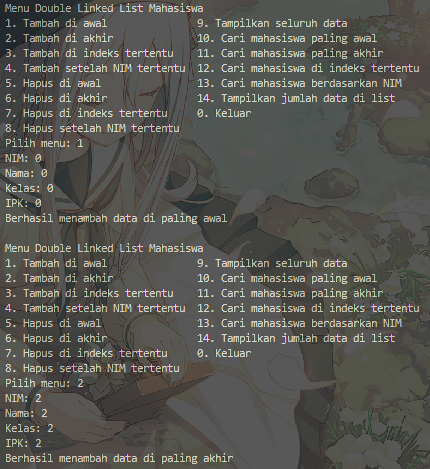
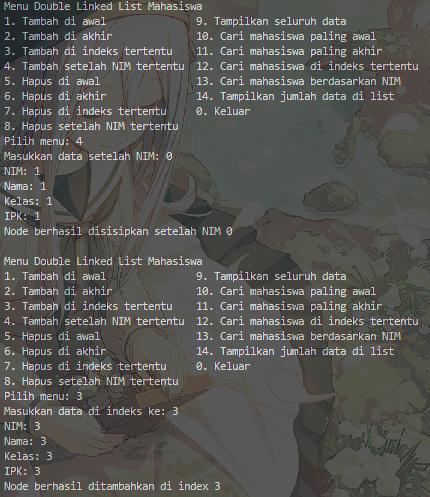
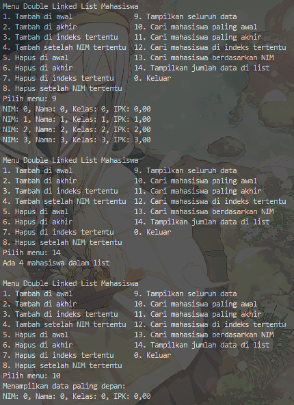
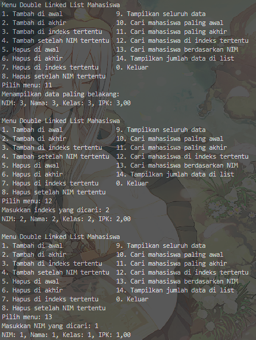
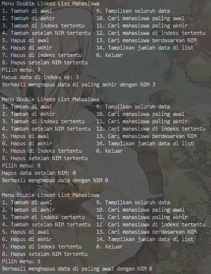
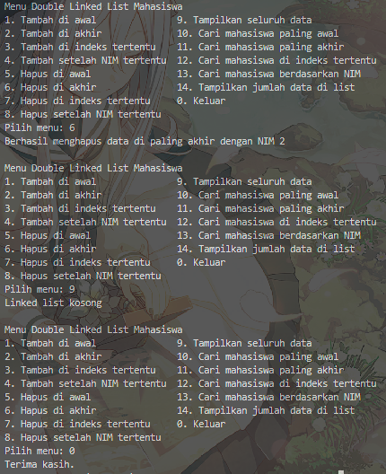

|            | Algorithm and Data Structure                                              |
| ---------- | ------------------------------------------------------------------------- |
| NIM        | 244107020028                                                              |
| Nama       | Muhammad Aryatama Mukapraja                                               |
| Kelas      | TI - 1H                                                                   |
| Repository | [link] (https://github.com/MuhammadAryatamaM/Algoritma-dan-Struktur-Data) |

# Jobhseet #12 Double Linked Lists

## Percobaan 1

### 12.2.2. Verifikasi Hasil Percobaan

Berikut hasil screenshot dari `DLLMain15.java`:



### 12.2.3 Jawaban Pertanyaan

1. Jelaskan perbedaan antara single linked list dengan double linked lists! <p>
   Jawab: Node single linked list hanya bisa akses node selanjutnya, sementara node double linked list bisa akses node sebelum dan selanjutnya
2. Perhatikan class **Node15**, di dalamnya terdapat atribut `next` dan `prev`. Untuk apakah atribut tersebut? <p>
   Jawab: `next` untuk mengakses node selanjutnya, `prev` untuk mengakses node sebelumnya
3. Perhatikan konstruktor pada class **DoubleLinkedLists15**. Apa kegunaan dari konstruktor tersebut? <p>
   ```
   public DoubleLinkedLists15() {
        head = null;
        tail = null;
   }
   ```
   Jawab: Agar saat instansiasi list `head` dan `tail` sebagai label, tidak ada dulu karena tidak ada data
4. Pada method **addFirst()**, apa maksud dari kode berikut? <p>
   ```
   if (isEmpty()) head = tail = newNode;
   ```
   Jawab: Jika tidak ada data, tambah `newNode` sebagai `head` sekaligus `tail`
5. Perhatikan pada method **addFirst()**. Apakah arti statement `head.prev = newNode`? <p>
   Jawab: Menyambung `head` lama dengan `newNode`
6. Modifikasi code pada fungsi **print()** agar dapat menampilkan warning/pesan bahwa linked lists masih dalam kondisi kosong. <p>
   Jawab:
   ```
   if (isEmpty()) System.out.println("Linked list kosong");
      else {
         Node15 current = head;
         while (current != null) {
            current.data.tampil();
            current = current.next;
         }
      }
   ```
7. Pada **insertAfter()**, apa maksud dari kode berikut? <p>
   ```
   current.next.prev = newNode;
   ```
   Jawab: Menyambung node setelah node input dengan node baru
8. Modifikasi menu pilihan dan switch-case agar fungsi **insertAfter()** masuk ke dalam menu pilihan dan dapat berjalan dengan baik.
   Jawab: <br>
   Di **main()**:
   ```
   case 4 -> {
      System.out.print("Masukkan data setelah NIM: ");
      String nim = sc.nextLine();
      Mahasiswa15 mhs = inputMahasiswa(sc);
      dll.insertAfter(nim, mhs);
   }
   ```
   Di **inputMahasiswa(sc)**:
   ```
   System.out.print("NIM: ");
   String nim = sc.nextLine();
   System.out.print("Nama: ");
   String nama = sc.nextLine();
   System.out.print("Kelas: ");
   String kelas = sc.nextLine();
   System.out.print("IPK: ");
   double ipk = sc.nextDouble();
   return new Mahasiswa15(nim, nama, kelas, ipk);
   ```

## Percobaan 2

### 12.3.2. Verifikasi Hasil Percobaan

Berikut hasil screenshot dari `DLLMain15.java`:



### 12.3.3. Jawaban Pertanyaan

1. Apakah maksud statement berikut pada method **removeFirst()**? <p>
   ```
   head = head.next;
   head.prev = null;
   ```
   Jawab: Memindah node head ke node setelahnya dan memutus node sebelumnya
2. Modifikasi kode program untuk menampilkan pesan “Data sudah berhasil dihapus. Data yang terhapus adalah … “ <p>
   Jawab: Modifikasi di `DoubleLinkedList15.java` di method **removeFirst**, **removeLast**, **remove**, dan **removeAfter**

## 13.4.1. Solusi Latihan Praktikum Antrian DLL

Solusi ada di `DLLMain15.java` dan `DoubleLinkedList15.java` dan berikut screenshot hasilnya

 <br>
 <br>
 <br>
 <br>
 <br>


**Penjelasan singkat:**

#### Pada DoubleLinkedList15.java ada 14 langkah utama:

1. Deklarasi `head` dan `tail` untuk `node` dan atribut `size`. Buat konstruktur lalu deklarasi `size = 0` dan `head` serta `tail` jadi `null`
2. Untuk method `isEmpty`: Return boolean `head == null`
3. Untuk method `searchNim`: Labeli `head` sementara sebagai `current`. Traversal sampai ketemu `keyNim`. Jika ketemu, return `current`, jika tidak return `null`
4. Untuk method `searchIndex`: Labeli `head` sementara sebagai `current` dan pakai `counter`. Traversal sampai ketemu `key` dengan update `counter` tiap loop. Jika ketemu, return `current`, jika tidak return `null`
5. Untuk method `addFirst`: Buat node baru sesuai input. Jika list kosong, jadikan `head` dan `tail`, jika tidak sambungkan node baru dengan `head` kedua arah dan pindah `head` ke node baru, lalu tambah `size` dengan 1
6. Untuk method `addLast`: Buat node baru sesuai input. Jika list kosong, jadikan `head` dan `tail`, jika tidak sambungkan node baru dengan `tail` kedua arah dan pindah `tail` ke node baru, lalu tambah `size` dengan 1
7. Untuk method `add`: Assign node `current` sesuai method **searchIndex(index)**. Jika `current` tidak null, jika index pertama panggil **addFirst(data)**, jika index terakhir panggil **addLast(data)**, selain itu assign node baru sesuai input lalu sambungkan node baru dengan `current`. Tambah `size` dengan 1
8. Untuk method `insertAfter`: Assign node `current` sesuai method **searchNim(keyNim)**. Jika `current` tidak null, jika index terakhir panggil **addLast(data)**, selain itu assign node baru sesuai input lalu sambungkan node baru dengan `current`. Tambah `size` dengan 1
9. Untuk method `removeFirst`: Jika list tidak kosong, jika hanya 1 data, null kan `head` dan `tail`, selain itu pindah label `head` ke node setelahnya dan putus sambungan `head` sekarang dengan node sebelumnya. Kurang `size` dengan 1
10. Untuk method `removeLast`: Jika list tidak kosong, jika hanya 1 data, null kan `head` dan `tail`, selain itu pindah label `tail` ke node sebelumnya dan putus sambungan `tail` sekarang dengan node setelahnya. Kurang `size` dengan 1
11. Untuk method `remove`: Assign node `current` sesuai method **searchIndex(index)**. Jika `current` tidak null, jika index pertama panggil **removeFirst(data)**, jika index terakhir panggil **removeLast(data)**, selain itu ganti sambungan node setelah `current` dengan node sebelum `current` kedua arah. Kurang `size` dengan 1
12. Untuk method `removeAfter`: Assign node `current` sesuai method **searchNim(keyNim)**. Jika `current` tidak null, jika index kedua terakhir panggil **removeLast(data)**, selain itu ganti sambungan node `current` dengan node setelah `current` dan setelahnya kedua arah. Kurang `size` dengan 1
13. Untuk method `print`: Jika list tidak kosong, assign `current` sebagai `head` sementara, lalu traversal sampai data terakhir dengan tiap `current` paggil method **tampil()**
14. Untuk method `getJumlahData`: Return `size`

#### Pada DLLMain15.java ada 16 langkah utama:

1. Instansiasi objek `dll` bertipe `DoubleLinkedList15` dengan dan buat while loop untuk menu
2. Menu 1 (Tambah di awal): Panggil **inputMahasiswa()** lalu masukkan ke **addFirst()**
3. Menu 2 (Tambah di akhir): Panggil **inputMahasiswa()** lalu masukkan ke **addLast()**
4. Menu 3 (Tambah di indeks tertentu): Input `index` dan panggil **inputMahasiswa()** lalu masukkan ke **add()**
5. Menu 4 (Tambah setelah NIM tertentu): Input `nim` dan panggil **inputMahasiswa()** lalu masukkan ke **insertAfter()**
6. Menu 5 (Hapus di awal): Panggil **removeFirst()**
7. Menu 6 (Hapus di akhir): Panggil **removeLast()**
8. Menu 7 (Hapus di indeks tertentu): Input `index` lalu masukkan ke **remove()**
9. Menu 8 (Hapus setelah NIM tertentu): Input `nim` lalu masukkan ke **removeAfter()**
10. Menu 9 (Tampilkan seluruh data): Panggil **print()**
11. Menu 10 (Cari mahasiswa paling awal): Panggil **searchIndex(0)** dan simpan ke `found`. Jika `found != null` tampilkan data `found`
12. Menu 11 (Cari mahasiswa paling akhir): Panggil **searchNim(getJumlahData() - 1)** dan simpan ke `found`. Jika `found != null` tampilkan data `found`
13. Menu 12 (Cari mahasiswa di indeks tertentu): Input `index` lalu masukkan ke **searchIndex()** dan simpan ke `found`. Jika `found != null` tampilkan data `found`
14. Menu 13 (Cari mahasiswa berdasarkan NIM): Input `nim` lalu masukkan ke **searchNim()** dan simpan ke `found`. Jika `found != null` tampilkan data `found`
15. Menu 14 (Tampilkan jumlah data di list): Panggil **getJumlahData()**
16. Untuk method `inputMahasiswa()`: Input tiap atribut lalu return objek dengan parameter tiap atribut
