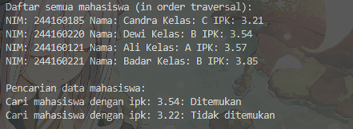
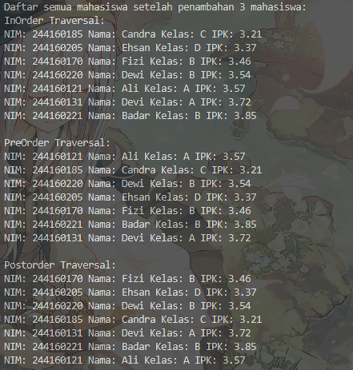
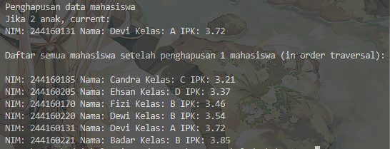
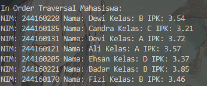
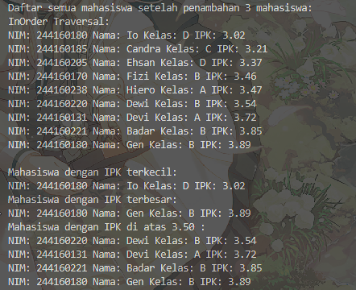
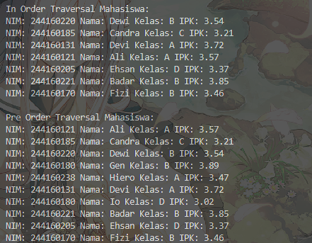

|            | Algorithm and Data Structure                                              |
| ---------- | ------------------------------------------------------------------------- |
| NIM        | 244107020028                                                              |
| Nama       | Muhammad Aryatama Mukapraja                                               |
| Kelas      | TI - 1H                                                                   |
| Repository | [link] (https://github.com/MuhammadAryatamaM/Algoritma-dan-Struktur-Data) |

# Jobhseet #14 Tree

## Percobaan 1: Implementasi Binary Search Tree menggunakan Linked List

### 14.2.2. Verifikasi Hasil Percobaan

Berikut hasil screenshot dari `BinaryTreeMain15.java`:





### 14.2.3 Jawaban Pertanyaan

1. Mengapa dalam binary search tree proses pencarian data bisa lebih efektif dilakukan dibanding binary tree biasa? <p>
   Jawab: Karena di BST, node terstruktur dengan node bagian kiri adalah node yang nilainya lebih kecil dari parent dan node bagian kanan adalah node yang nilainya lebih besar dari parent. Pengurutan ini membuat pencarian lebih cepat dibandingkan binary tree biasa yang mencari tiap node
2. Untuk apakah di class **Node**, kegunaan dari atribut `left` dan `right`? <p>
   Jawab: Untuk menentukan node masuk left child atau right child dan bisa mengaksesnya
3. a. Untuk apakah kegunaan dari atribut root di dalam class **BinaryTree**? <p>
   Jawab: Untuk menyimpan node paling atas (tidak ada parent) yang akan digunakan untuk bisa mengakses semua node <p>
   b. Ketika objek tree pertama kali dibuat, apakah nilai dari `root`? <p>
   Jawab: `null`
4. Ketika tree masih kosong, dan akan ditambahkan sebuah node baru, proses apa yang akan terjadi? <p>
   Jawab: Node baru akan dijadikan `root`
5. Perhatikan method **add()**, di dalamnya terdapat baris program seperti di bawah ini. Jelaskan secara detail untuk apa baris program tersebut? <p>
   ```
    parent = current;
    if (data.ipk < current.data.ipk) {
        current = current.left;
        if (current == null) {
            parent.left = newNode;
            return;
        }
    } else {
        current = current.right;
        if (current == null) {
            parent.right = newNode;
            return;
        }
    }
   ```
   Jawab: `parent` dipilih lalu cek dimana node bagian kiri adalah node yang nilainya lebih kecil dari parent dan node bagian kanan adalah node yang nilainya lebih besar dari parent. Loop sampai node di tempat yang pas.
6. Jelaskan langkah-langkah pada method **delete()** saat menghapus sebuah node yang memiliki dua anak. Bagaimana method **getSuccessor()** membantu dalam proses ini? <p>
   Jawab: <p>
   1. `Node15 successor = getSuccessor(current);` mengambil successor dari node yang dihapus, yaitu node terkecil dari subtree kanan agar menjaga struktur BST tetap valid
   2. `if (current == root) root = successor;` jika yang dihapus adalah root, ganti dengan successornya
   3. `if (isLeftChild) parent.left = successor;` jika yang dihapus adalah child bagian kiri, update sambungan antara parent (dari node yang dihapus) dengan successor; `else parent.right = successor;` atau sebaliknya (child bagian kanan)
   4. `successor.left = current.left;` update sambungan kiri successor (node yang baru dihapus) dengan kiri current (yang punya data tree lama) <p>
      Jadi, **getSuccessor()** membantu mengambil successor (node terkecil dari subtree kanan) agar menjaga struktur BST tetap valid

## Percobaan 2: Implementasi Binary Tree dengan Array

### 14.3.2. Verifikasi Hasil Percobaan

Berikut hasil screenshot dari `BinaryTreeArrayMain15.java`:



### 14.3.3. Jawaban Pertanyaan

1. Apakah kegunaan dari atribut `data` dan `idxLast` yang ada di class **BinaryTreeArray**? <p>
   Jawab: `data` menyimpan data mahasiswa dalam array, `idxLast` label indeks terakhir array (yang ada datanya)
2. Apakah kegunaan dari method **populateData()**? <p>
   Jawab: Menaruh data yang sudah ada di main ke kelas **BinaryTreeArray15**
3. Apakah kegunaan dari method **traverseInOrder()**? <p>
   Jawab: Print data tree dengan cara in order
4. Jika suatu node binary tree disimpan dalam array indeks `2`, maka di indeks berapakah posisi left child dan right child masing-masing? <p>
   Jawab: Left child bisa dicari dengan `2*idxStart + 1`, posisinya indeks 5. Right child bisa dicari dengan `2*idxStart+2`, posisinya indeks 6.
5. Apa kegunaan statement `int idxLast = 6` pada praktikum 2 percobaan nomor 4? <p>
   Jawab: `idxLast` label indeks terakhir array (yang ada datanya) di indeks 6
6. Mengapa indeks `2*idxStart + 1` dan `2*idxStart + 2` digunakan dalam pemanggilan rekursif, dan apa kaitannya dengan struktur pohon biner yang disusun dalam array? <p>
   Jawab: Struktur binary tree adalah tiap level, jumlah nodenya 2x lipat. `2*idxStart` = total node sebelum level `idxStart`. Left child adalah 1 node setelah urutan level (`+ 1`), dan right child adalah node setelah left child (`+ 2`). Digunakan rekursif untuk perulangan sampai semua node terakses

## 14.4.1. Solusi Latihan Praktikum Binary Tree (1-3)

Solusi ada di `BinaryTreeMain15.java` dan `BinaryTree15.java` dan berikut screenshot hasilnya



**Penjelasan singkat:**

#### Pada BinaryTree15.java ada 14 langkah utama:

1. Buat atribut `root`. Buat konstruktur lalu deklarasi `root` jadi `null`
2. Untuk method `isEmpty`: Return boolean `root == null`
3. Untuk method `addR`: Memanggil **addRekursif()** dengan `root` sekarang dan `data` yang diinput
4. Untuk method `addRekursif`: Jika `data.ipk` lebih kecil dari suatu node, pindah ke kiri atau jika `data.ipk` lebih besar dari suatu node, pindah ke kanan. Saat sudah sampai leaf, buat dan return node sesuai `data` yang diinput dan update sambungannya
5. Untuk method `add`: Jika tree kosong, jadikan node baru sebagai `root`. Jika `data.ipk` lebih kecil dari suatu node, pindah ke kiri atau jika `data.ipk` lebih besar dari suatu node, pindah ke kanan. Saat sudah sampai leaf, sambung node baru dengan `parent`
6. Untuk method `find`: Set `result` ke `false` dan `current` ke `root`. Traverse dengan `current`, jika ketemu, set `result` ke `true` dan `break`. Di akhir, return `result`
7. Untuk method `traversePreOrder`: Print dengan Pre Order, yaitu dari `root` ke subtree kiri ke subtree kanan
8. Untuk method `traverseInOrder`: Print dengan In Order, yaitu dari subtree kiri ke `root` ke subtree kanan
9. Untuk method `traversePostOrder`: Print dengan Post Order, yaitu dari subtree kiri ke subtree kanan ke `root`
10. Untuk method `cariMinIPK`: Simpan sementara nilai `root` ke `current`. Loop `current` ke kiri sampai sebelum kirinya `null`. Tampil data `current` setelah loop selesai
11. Untuk method `cariMaxIPK`: Simpan sementara nilai `root` ke `current`. Loop `current` ke kanan sampai sebelum kanannya `null`. Tampil data `current` setelah loop selesai
12. Untuk method `tampilMahasiswaIPKdiAtas`: Print dengan In Order, tapi jika `node.data.ipk` lebih dari `ipk` dari yang diinput, print data node itu
13. Untuk method `getSuccessor`: Deklarasi `successor` sebagai node bagian kanan dari node yang mau dihapus, juga simpan parentnya. Pindah `successor` dan parentnya tiap dipindah ke kiri sampai sebelum kirinya `null`. Jika `successor` bukan right child langsung dari node yang mau dihapus, update sambungan dengan `successorParent.left = successor.right;` dan `successor.right = del.right;` (jika `successor` punya right child, jika tidak berarti `null`. Ini menyambung bagian kanan `del` dengan `successor`). Return `successor`.
14. Untuk method `delete`: Cari node yang mau dihapus, simpan sementara nilai `root` ke `current` dan `parent`. Traverse sampai ketemu. Saat ketemu, jika 0 anak, `null` kan sambungan `parent` dengan anaknya. Jika 1 anak, ganti `parent` nya (`.left` atau `.right` tergantung posisi yang dihapus) dengan anaknya `current` (`.left` atau `.right` tergantung posisi anak). Jika 2 anak, panggil **getSuccessor()** yang akan dipakai untuk ganti sambungan `parent` nya dengan `successor` yang dipakai

#### Pada BinaryTreeMain15.java ada 13 langkah utama:

1. Instansiasi objek `bst` bertipe `BinaryTree15`
2. Panggil **add()** lalu masukkan ke data ke parameter
3. Panggil **traverseInOrder()** untuk print In Order dengan parameter `root`
4. Panggil **find()** lalu masukkan `ipk` ke parameter. Simpan hasilnya ke `hasilCari`, lalu print
5. Panggil **add()** lagi lalu masukkan ke data ke parameter
6. Panggil **traverseInOrder()** untuk print In Order, **traversePreOrder()** untuk print Pre Order, **traversePostOrder()** untuk print Post Order, semua dengan parameter `root`
7. Panggil **delete()** dengan parameternya `ipk`
8. Panggil **traverseInOrder()** untuk print In Order dengan parameter `root` setelah penghapusan
9. Panggil **addR()** lalu masukkan ke data ke parameter untuk add versi rekursif
10. Panggil **traverseInOrder()** untuk print In Order dengan parameter `root` setelah penambahan
11. Panggil **cariMinIPK()** untuk menampilkan mahasiswa dengan IPK terkecil
12. Panggil **cariMaxIPK()** untuk menampilkan mahasiswa dengan IPK terbesar
13. Panggil **tampilMahasiswaIPKdiAtas()** untuk menampilkan mahasiswa dengan IPK di atas `ipk` yang diinginkan

## 14.4.2. Solusi Latihan Praktikum Binary Tree (4)

Solusi ada di `BinaryTreeArrayMain15.java` dan `BinaryTreeArray15.java` dan berikut screenshot hasilnya



**Penjelasan singkat:**

#### Pada BinaryTreeArray15.java ada 5 langkah utama:

1. Buat atribut array `dataMahasiswa` dan `idxLast`. Buat konstruktur lalu set ukuran array
2. Untuk method `populateData`: Isi atribut yang didapat dari main
3. Untuk method `add`: Increment `idxLast` dan masukkan `data` dengan indeks `idxLast` selama masih kurang dari ukuran array
4. Untuk method `traverseInOrder`: Print dengan In Order, yaitu dari subtree kiri ke `root` ke subtree kanan
5. Untuk method `traversePreOrder`: Print dengan Pre Order, yaitu dari `root` ke subtree kiri ke subtree kanan

#### Pada BinaryTreeMain15.java ada 7 langkah utama:

1. Instansiasi objek `bta` bertipe `BinaryTreeArray15`
2. Buat objek `mhs` dengan atributnya
3. Masukkan tiap `mhs` ke array dan set `idxLast` sesuai indeks terakhir yang terisi
4. Panggil **populateData()** berisi array dan `idxLast`
5. Panggil **traverseInOrder()** untuk print In Order dengan parameter `0`
6. Panggil **add()** lalu masukkan ke data ke parameter
7. Panggil **traversePreOrder()** untuk print Pre Order dengan parameter `0`
