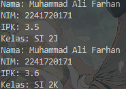
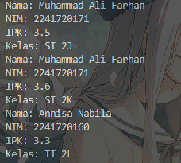
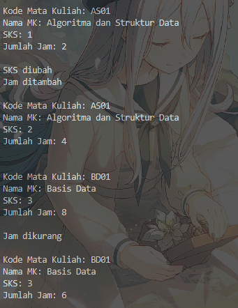
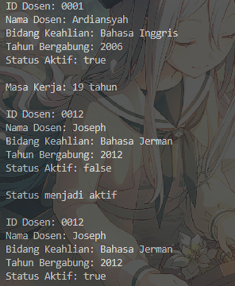

|            | Algorithm and Data Structure                                              |
| ---------- | ------------------------------------------------------------------------- |
| NIM        | 244107020028                                                              |
| Nama       | Muhammad Aryatama Mukapraja                                               |
| Kelas      | TI - 1H                                                                   |
| Repository | [link] (https://github.com/MuhammadAryatamaM/Algoritma-dan-Struktur-Data) |

# Jobhseet #2 Object

## Percobaan 1: Deklarasi Class, Atribut dan Method

### 2.1.2. Verifikasi Hasil Percobaan

Berikut hasil screenshot dari Mahasiswa15.java:


### 2.1.3. Jawaban Pertanyaan

1. Sebutkan dua karakteristik class atau object!<p>
   Jawab: Mempunyai sesuatu dan melakukan sesuatu
2. Perhatikan class **Mahasiswa** pada Praktikum 1 tersebut, ada berapa atribut yang dimiliki oleh class
   Mahasiswa? Sebutkan apa saja atributnya!<p>
   Jawab: Ada 4: Nama, NIM, ipk, dan kelas
3. Ada berapa method yang dimiliki oleh class tersebut? Sebutkan apa saja methodnya!<p>
   Jawab: Ada 4: tampilkanInformasi(), ubahKelas(), updateIpk(),dan nilaiKinerja()
4. Perhatikan method **updateIpk()** yang terdapat di dalam class **Mahasiswa**. Modifikasi isi method
   tersebut sehingga IPK yang dimasukkan valid yaitu terlebih dahulu dilakukan pengecekan apakah
   IPK yang dimasukkan di dalam rentang 0.0 sampai dengan 4.0 (0.0 <= IPK <= 4.0). Jika IPK tidak
   pada rentang tersebut maka dikeluarkan pesan: "IPK tidak valid. Harus antara 0.0 dan 4.0"<p>
   Jawab: Di method **updateIpk()**:
   ```
   if (ipkBaru < 0 || ipkBaru > 4) {
      System.out.println("IPK tidak valid. Harus antara 0.0 dan 4.0");
   } else {
      ipk = ipkBaru;
   }
   ```
5. Jelaskan bagaimana cara kerja method **nilaiKinerja()** dalam mengevaluasi kinerja mahasiswa,
   kriteria apa saja yang digunakan untuk menentukan nilai kinerja tersebut, dan apa yang
   dikembalikan (di-return-kan) oleh method nilaiKinerja() tersebut?<p>
   Jawab: Saat **nilaiKinerja()** dipanggil, akan mengecek variabel ipk dan diberi 4 kondisi:
   1. Jika ipk >= 3.5, return "Kinerja sangat baik"
   2. Apabila kondisi 1 tidak terpenuhi, jika ipk >= 3.0, return "Kinerja baik"
   3. Apabila kondisi 1 dan 2 tidak terpenuhi, jika ipk >= 2.5, return "Kinerja cukup"
   4. Apabila semua kondisi tidak terpenuhi, return "Kinerja kurang"

## Percobaan 2: Instansiasi Object, serta Mengakses Atribut dan Method

### 2.2.2. Verifikasi Hasil Percobaan

Berikut hasil screenshot dari MahasiswaMain15.java:



### 2.2.3. Jawaban Pertanyaan

1. Pada class **MahasiswaMain**, tunjukkan baris kode program yang digunakan untuk proses instansiasi!
   Apa nama object yang dihasilkan?<p>
   Jawab: Terdapat di baris `Mahasiswa15 mhs1 = new Mahasiswa15();` dengan object bernama **mhs1**
2. Bagaimana cara mengakses atribut dan method dari suatu objek?<p>
   Jawab: Memberi nilai atribut di suatu objek dengan `<namaObjek>.<namaAtribut> = <nilai>`, seperti `mhs1.nama = "Muhammad Ali Farhan";`, sedangkan mengakses method dengan `<namaObjek>.<namaMethod(parameter);>` seperti `mhs1.ubahKelas("SI 2K");`
3. Mengapa hasil output pemanggilan method **tampilkanInformasi()** pertama dan kedua berbeda?<p>
   Jawab: Karena pada panggilan pertama, nilai **mhs1** yang sudah diberikan akan muncul. Lalu, data kelas diubah dengan `mhs1.ubahKelas("SI 2K");`, hal yang sama dengan ipk. Hal ini membuat informasi yang ditampilkan berbeda pada pemanggilan kedua

## Percobaan 3: Membuat Konstruktor

### 2.3.2. Verifikasi Hasil Percobaan

Berikut hasil screenshot dari Mahasiswa15.java:



### 2.3.3. Jawaban Pertanyaan

1. Pada class **Mahasiswa** di Percobaan 3, tunjukkan baris kode program yang digunakan untuk
   mendeklarasikan konstruktor berparameter!<p>
   Jawab: Ada di baris:
   ```
   public Mahasiswa15(String nm, String nim, double ipk, String kls) {
        nama = nm;
        this.nim = nim;
        this.ipk = ipk;
        kelas = kls;
    }
   ```
2. Perhatikan class MahasiswaMain. Apa sebenarnya yang dilakukan pada baris program
   berikut?
   <p>
   Jawab: Instansiasi objek menggunakan konstruktor berparameter dengan memasukkan atribut nama, nim, ipk, dan kelas secara berurutan
3. Hapus konstruktor default pada class **Mahasiswa**, kemudian compile dan run program.
   Bagaimana hasilnya? Jelaskan mengapa hasilnya demikian<p>
   Jawab: File **MahasiswaMain** error ketika konstruktor defaultnya dihapus karena kita telah meng-instansiasi objek dengan konstruktor default, yaitu `Mahasiswa15 mhs1 = new Mahasiswa15();`,
4. Setelah melakukan instansiasi object, apakah method di dalam class **Mahasiswa** harus diakses
   secara berurutan? Jelaskan alasannya!<p>
   Jawab: Tidak, kita bisa mengakses method apapun tanpa urutan tertentu, walaupun urutan dapat memengaruhi apa yang dimasukkan dan ditampilkan
5. Buat object baru dengan nama `mhs<NamaMahasiswa>`menggunakan konstruktor
   berparameter dari class **Mahasiswa**!<p>
   Jawab: `Mahasiswa15 mhsMuhammadAryatamaMukapraja = new Mahasiswa15("Muhammad Aryatama Mukapraja", "244107020028", 3.86, "TI 1H");`

## 2.4.1. Solusi Latihan Praktikum Mata Kuliah

Solusi ada di MataKuliah15.java dan MataKuliahMain15.java, dan berikut screenshot hasilnya



**Penjelasan singkat:**

#### Pada MataKuliah15.java ada 2 langkah utama:

1. Deklarasi atribut serta konstruktor, baik yang berparameter maupun tidak
2. Membuat method: <p>
   - tampilInformasi(), berisi print dari tiap atribut
   - ubahSks(int sksBaru), berisi penggantian sks lama dengan sks baru sesuai parameter
   - tambahJam(int jam), berisi penambahan jam lama dengan jam yang sesuai parameter
   - kurangiJam(int jam), berisi pengurangan jam lama dengan jam yang sesuai parameter, dengan syarat jam pengurang tidak lebih dari jam lama

#### Pada MataKuliahMain15.java ada 2 langkah utama:

1. Instansiasi objek default dengan memberi masing-masing objek sebuah atribut setelah objek dibuat, lalu panggil method yang diinginkan
2. Instansiasi objek berparameter dengan memberi masing-masing objek sebuah atribut dalam parameter objek, lalu panggil method yang diinginkan

## 2.4.2. Solusi Latihan Praktikum Dosen

Solusi ada di Dosen15.java dan DosenMain15.java, dan berikut screenshot hasilnya



**Penjelasan singkat:**

#### Pada Dosen15.java ada 2 langkah utama:

1. Deklarasi atribut serta konstruktor, baik yang berparameter maupun tidak
2. Membuat method: <p>
   - tampilInformasi(), berisi print dari tiap atribut
   - setStatusAktif(boolean status), berisi penggantian atribut statusAktif, jika status = true maka statusAktif menjadi true (aktif) dan sebaliknya
   - hitungMasaKerja(int thnSkrg), berisi pengurangan atribut tahunBergabung dengan parameter thnSkrg serta print hasilnya
   - ubahKeahlian(String bidang), berisi penggantian atribut bidangKeahlian dengan parameter bidang

#### Pada DosenMain15.java ada 2 langkah utama:

1. Instansiasi objek default dengan memberi masing-masing objek sebuah atribut setelah objek dibuat, lalu panggil method yang diinginkan
2. Instansiasi objek berparameter dengan memberi masing-masing objek sebuah atribut dalam parameter objek, lalu panggil method yang diinginkan
