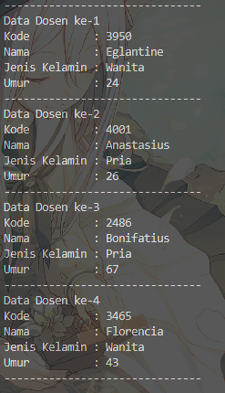

|            | Algorithm and Data Structure                                              |
| ---------- | ------------------------------------------------------------------------- |
| NIM        | 244107020028                                                              |
| Nama       | Muhammad Aryatama Mukapraja                                               |
| Kelas      | TI - 1H                                                                   |
| Repository | [link] (https://github.com/MuhammadAryatamaM/Algoritma-dan-Struktur-Data) |

# Jobhseet #3 Array of Objects

## Percobaan 1: Membuat Array dari Object, Mengisi dan Menampilkan

### 3.2.2. Verifikasi Hasil Percobaan

Berikut hasil screenshot dari MahasiswaDemo15.java:


### 3.2.3. Jawaban Pertanyaan

1. Berdasarkan uji coba 3.2, apakah **class** yang akan dibuat **array of object** harus selalu memiliki
   **atribut** dan sekaligus **method**? Jelaskan! <p>
   Jawab: Tidak, di percobaan tidak memiliki method namun program masih bisa jalan karena memang tidak ada method yang ada dan yang bisa dipanggil
2. Apa yang dilakukan oleh kode program berikut?<p>
   `Mahasiswa15[] arrayOfMahasiswa = new Mahasiswa15[3];`<p>
   Jawab: Deklarasi array nama 'arrayOfMahasiswa' bertipe objek 'Mahasiswa15' dengan panjang 3
3. Apakah class **Mahasiswa** memiliki konstruktor? Jika tidak, kenapa bisa dilakukan pemanggilan
   konstruktur pada baris program berikut? <p>
   `arrayOfMahasiswa[0] = new Mahasiswa15();` <p>
   Jawab: Tidak ada konstruktor yang tertulis secara eksplisit, namun jika tidak ada maka akan digunakan konstruktor default (`Mahasiswa()`)
4. Apa yang dilakukan oleh kode program berikut? <p>

   ```
   arrayOfMahasiswa[0] = new Mahasiswa15();
   arrayOfMahasiswa[0].nim = "244107060033";
   arrayOfMahasiswa[0].nama = "AGNES TITANIA KINANTI";
   arrayOfMahasiswa[0].kelas = "SIB-1E";
   arrayOfMahasiswa[0].ipk = (float) 3.75;
   ```

   Jawab: Instansiasi objek baru yang disimpan di array 'arrayOfMahasiswa' pada indeks 0, lalu mengisi tiap atribut (nim, nama, kelas, ipk) di indeks 0

5. Mengapa class **Mahasiswa** dan **MahasiswaDemo** dipisahkan pada uji coba 3.2? <p>
   Jawab: Class **Mahasiswa** digunakan untuk membuat objek yang akan diperlukan dan dijalankan oleh class **MahasiswaDemo**

## Percobaan 2: Menerima Input Isian Array Menggunakan Looping

### 3.3.2. Verifikasi Hasil Percobaan

Berikut hasil screenshot dari MahasiswaDemo15.java:


### 3.3.3. Jawaban Pertanyaan

1. Tambahkan method **cetakInfo()** pada class **Mahasiswa15** kemudian modifikasi kode program
   pada langkah no 3.<p>
   Jawab:<br>
   Pada **Mahasiswa15**:
   ```
   void cetakInfo(Mahasiswa15[] mhs, int i) {
      System.out.println("Data mahasiswa ke-" + (i+1));
      System.out.println("NIM       : " + mhs[0].nim);
      System.out.println("Nama      : " + mhs[0].nama);
      System.out.println("Kelas     : " + mhs[0].kelas);
      System.out.println("IPK       : " + mhs[0].ipk);
      System.out.println("---------------------------------------");
   }
   ```
   Pada **MahasiswaDemo15**, semua print dihapus menjadi:
   ```
   for (int i = 0; i < 3; i++) {
      arrayOfMahasiswa[i].cetakInfo(arrayOfMahasiswa, i);
   }
   ```
2. Misalkan Anda punya array baru bertipe **array of Mahasiswa** dengan nama
   **myArrayOfMahasiswa**. Mengapa kode berikut menyebabkan error? <p>
   ```
   Mahasiswa[] myArrayOfMahasiswa = new Mahasiswa[3];
   myArrayOfMahasiswa[0].nim = "244107060033";
   myArrayOfMahasiswa[0].nama = "AGNES TITANIA KINANTI";
   myArrayOfMahasiswa[0].kelas = "SIB-1E";
   myArrayOfMahasiswa[0].ipk = (float) 3.75;
   ```
   Jawab: Karena objek myArrayOfMahasiswa[0] belum diinstansiasi, sementara kita memberi atribut kepada objek yang belum ada

## Percobaan 3: Constructor Berparameter

### 3.4.2. Verifikasi Hasil Percobaan

Berikut hasil screenshot dari MatakuliahDemo15.java:


### 3.4.3. Jawaban Pertanyaan

1. Apakah suatu class dapat memiliki lebih dari 1 constructor? Jika iya, berikan contohnya<p>
   Jawab: Bisa, contohnya membuat kontruktor default `public Matakuliah15(){}`
2. Tambahkan method **tambahData()** pada class **Matakuliah**, kemudian gunakan method
   tersebut di class **MatakuliahDemo** untuk menambahkan data **Matakuliah**<p>
   Jawab:<br>
   Pada **Matakuliah15**:

   ```
   public Matakuliah15() {
   }

   void tambahData (Matakuliah15[] arrayMatkul, int i) {
      System.out.println("Masukkan Data Matakuliah ke-" + (i+1));
      System.out.print("Kode       : ");
      kode = sc.nextLine();
      System.out.print("Nama       : ");
      nama = sc.nextLine();
      System.out.print("SKS        : ");
      sks = sc.nextInt();
      System.out.print("Jumlah Jam : ");
      jumlahJam = sc.nextInt();
      System.out.println("---------------------------------------");

      arrayMatkul[i] = new Matakuliah15(kode, nama, sks, jumlahJam);
   }
   ```

   Pada **MahasiswaDemo15**:

   ```
   for (int i = 0; i < 3; i++) {
      arrayOfMataKuliah[i] = new Matakuliah15();
      arrayOfMataKuliah[i].tambahData(arrayOfMataKuliah, i);
   }
   ```

3. Tambahkan method **cetakInfo()** pada class **Matakuliah**, kemudian gunakan method
   tersebut di class **MatakuliahDemo** untuk menampilkan data hasil inputan di layar <p>
   Jawab:<br>
   Pada **Matakuliah15**:
   ```
   void cetakInfo (Matakuliah15[] arrayMatkul, int i) {
      System.out.println("Data Matakuliah ke-" + (i+1));
      System.out.println("Kode       : " + arrayMatkul[i].kode);
      System.out.println("Nama       : " + arrayMatkul[i].nama);
      System.out.println("SKS        : " + arrayMatkul[i].sks);
      System.out.println("Jumlah Jam : " + arrayMatkul[i].jumlahJam);
      System.out.println("---------------------------------------");
   }
   ```
   Pada **MatakuliahDemo**:
   ```
   for (int i = 0; i < 3; i++) {
      arrayOfMataKuliah[i].cetakInfo(arrayOfMataKuliah, i);
   }
   ```
4. Modifikasi kode program pada class **MatakuliahDemo** agar panjang (jumlah elemen) dari
   **array of object Matakuliah** ditentukan oleh user melalui input dengan Scanner <p>
   Jawab: Mengganti 3 menjadi input dari variabel jmlMatkul, temrmasuk looping menjadi i < jmlMatkul

   ```
   Scanner sc = new Scanner(System.in);

   System.out.print("Masukkan Jumlah Matakuliah: ");
   int jmlMatkul = sc.nextInt();

   Matakuliah15[] arrayOfMataKuliah = new Matakuliah15[jmlMatkul];
   ```

## 2.4.1. Solusi Latihan Praktikum Dosen

Solusi ada di Dosen15.java dan DosenDemo15.java, dan berikut screenshot hasilnya




**Penjelasan singkat:**

#### Pada Dosen15.java ada 1 langkah utama:

1. Deklarasi atribut serta konstruktor berparameter

#### Pada DosenDemo15.java ada 3 langkah utama:

1. Membuat array dari objek Dosen15
2. Membuat loop untuk input tiap atribut yang disimpan dalam variabel sementara, yang lalu variabel itu dimasukkan sebagai parameter untuk membuat objek dengan konstruktor berparameter yang sudah dibuat
3. Untuk mencetak info, buat fungsi yang isinya print dengan arrayOfDosen15 dan j (index) sebagai parameter, lalu terus menerus memanggil fungsi dengan looping

## 2.4.2. Solusi Latihan Praktikum Data Dosen

Solusi ada di DataDosen15.java, DosenDemo15.java, dan Dosen15.java, dan berikut screenshot hasilnya


**Penjelasan singkat:**

#### Pada Dosen15Demo.java ada 1 langkah utama:

1. Buat while loop untuk menu dan switch case untuk memilih menu berdasarkan input

#### Pada DataDosen15.java ada 5 langkah utama:

1. Method dataSemuaDosen(Dosen15 arrayOfDosen[]): loop tiap index array untuk cetak tiap atribut di tiap objek
2. Method jumlahDosenPerJenisKelamin(Dosen15 arrayOfDosen[]): loop tiap index array dengan cek atribut jenisKelamin (jika true counter pria naik, jika false counter wanita naik). Selesai loop, print hasil
3. Method rerataUsiaDosenPerJenisKelamin(Dosen15 arrayOfDosen[]): loop tiap index array dengan cek atribut jenisKelamin (jika true counter pria naik, jika false counter wanita naik) dan atribut umur (jika dalam atribut pria, tambah umur total pria, jika dalam atribut wanita, tambah umur total wanita). Selesai loop, print hasil berupa umur total dibagi counter untuk tiap jenis kelamin
4. Method infoDosenPalingTua(Dosen15 arrayOfDosen[]): loop tiap index array dengan cek atribut umur, dengan variabel sementara bernilai 0. Jika ada atribut umur yang lebih dari variabel sementara, variabel diganti dengan umur tersebut dan indexnya di variabel lain. Selesai loop, cetak tiap atribut dosen sesuai indeksnya
5. Method infoDosenPalingMuda(Dosen15 arrayOfDosen[]): loop tiap index array dengan cek atribut umur, dengan variabel sementara bernilai sesuai atribut umur indeks 0. Jika ada atribut umur yang kurang dari variabel sementara, variabel diganti dengan umur tersebut dan indexnya di variabel lain. Selesai loop, cetak tiap atribut dosen sesuai indeksnya
