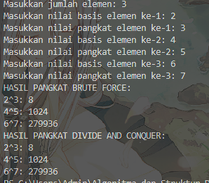
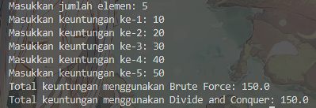

|            | Algorithm and Data Structure                                              |
| ---------- | ------------------------------------------------------------------------- |
| NIM        | 244107020028                                                              |
| Nama       | Muhammad Aryatama Mukapraja                                               |
| Kelas      | TI - 1H                                                                   |
| Repository | [link] (https://github.com/MuhammadAryatamaM/Algoritma-dan-Struktur-Data) |

# Jobhseet #4 Brute Force dan Divide Conquer

## Percobaan 1: Menghitung Nilai Faktorial dengan Algoritma Brute Force dan Divide and Conquer

### 4.2.2. Verifikasi Hasil Percobaan

Berikut hasil screenshot dari `MainFaktorial15.java`:


### 4.2.3. Jawaban Pertanyaan

1. Pada base line Algoritma Divide Conquer untuk melakukan pencarian nilai faktorial, jelaskan
   perbedaan bagian kode pada penggunaan if dan else! <p>
   Jawab: Bagian `if` sebagai base case yang akan memberhentikan fungsi rekursif, bagian `else` akan menjalankan kode yang dieprlukan dan memanggil fungsi rekursif dengan parameter yang berbeda
2. Apakah memungkinkan perulangan pada method `faktorialBF()` diubah selain menggunakan
   for? Buktikan!<p>
   Jawab: Bisa, dengan while loop:

   ```
   int fakto = 1, i = 1;
   while (i <= n) {
      fakto = fakto * i;
      i++;
   }

   return fakto;
   ```

3. Jelaskan perbedaan antara `fakto *= i;` dan `int fakto = n * faktorialDC(n-1);` ! <p>
   Jawab: `fakto *= i;` dengan cara Brute Force dengan langsung mengalikan tiap angka, sedangkan `int fakto = n * faktorialDC(n-1);`dengan cara Divide and Conquer memecah bagian dahulu dengan fungsi rekursif lalu mengalikan hasil angka tiap bagian
4. Buat Kesimpulan tentang perbedaan cara kerja method `faktorialBF()` dan `faktorialDC()`! <p>
   Jawab: `faktorialBF()` langsung beroperasi dengan angka yang ada, `faktorialDC()` beroperasi setelah bagian telah dipecah sampai base case

## Percobaan 2: Menghitung Hasil Pangkat dengan Algoritma Brute Force dan Divide and Conquer

### 4.3.2. Verifikasi Hasil Percobaan

Berikut hasil screenshot dari `MainPangkat15.java`:



### 4.3.3. Jawaban Pertanyaan

1. Jelaskan mengenai perbedaan 2 method yang dibuat yaitu `pangkatBF()` dan `pangkatDC()`! <p>
   Jawab: `pangkatBF()` menggunakan Brute Force, `pangkatDC()` menggunakan Divide and Conquer
2. Apakah tahap combine sudah termasuk dalam kode tersebut? Tunjukkan! <p>
   Jawab: Sudah, di `return a;`
3. Pada method `pangkatBF()` terdapat parameter untuk melewatkan nilai yang akan dipangkatkan
   dan pangkat berapa, padahal di sisi lain di class `Pangkat` telah ada atribut `nilai` dan `pangkat`,
   apakah menurut Anda method tersebut tetap relevan untuk memiliki parameter? Apakah bisa
   jika method tersebut dibuat dengan tanpa parameter? Jika bisa, seperti apa method
   `pangkatBF()` yang tanpa parameter? <p>
   Jawab: Bisa, namun tidak bisa input elemen, basis, dan pangkat secara dinamis. Hasil di `Q5333.java` dan `MainQ5333.java`
4. Tarik tentang cara kerja method `pangkatBF()` dan `pangkatDC()`! <p>
   Jawab: `pangkatBF()` menghitung pangkat dengan mengalikan basis dengan perulangan sebanyak n kali, `pangkatDC()` memecah sampai n tidak bisa dibagi lagi dengan 2 yang lalu a dikali a sebanyak (jumlah pecahan) kali

## Percobaan 3: Menghitung Sum Array dengan Algoritma Brute Force dan Divide and Conquer

### 4.4.2. Verifikasi Hasil Percobaan

Berikut hasil screenshot dari `MainSum15.java`:



### 4.4.3. Jawaban Pertanyaan

1. Kenapa dibutuhkan variable `mid` pada method `TotalDC()`?<p>
   Jawab: Agar mendapatkan nilai tengah yang dibagi untuk sisi kiri dan sisi kanan
2. Untuk apakah statement di bawah ini dilakukan dalam `TotalDC()`? <br>

   ```
   double lsum = totalDC(arr, l, mid);
   double rsum = totalDC(arr, mid + 1, r);
   ```

   Jawab: Untuk tiap pecahan selalu membagi menjadi sisi kiri dan sisi kanan sampai tidak bisa lagi

3. Kenapa diperlukan penjumlahan hasil lsum dan rsum seperti di bawah ini? <br>

   ```
   return lsum + rsum;
   ```

   Jawab: Menggabungkan hasil penjumlahan sisi kiri dan sisi kanan dari pecahan kecil sampai pecahan terakhir

4. Apakah base case dari `totalDC()`?<p>
   Jawab: `l == r`
5. Tarik Kesimpulan tentang cara kerja `totalDC()`?<p>
   Jawab: Parameternya berupa array, index pertama, dan index terakhir. Diambil nilai tengah (mid), dimana sisi kiri berawal dari index pertama sampai mid dan sisi kanan berawal dari `mid + 1` sampai index terakhir. Jika `l != r`, bagi lagi dengan proses yang sama. Setelah kedua sisi punya nilai yang sama (`l == r`), return nilainya dengan menjumlahkan sisi kiri dan sisi kanannya. Tiap pecahan akan masing-masing return nilai lalu dijumlah, sampai pecahan terbesar dan solusi terakhir

## 4.4.1. Solusi Latihan Praktikum Daftar Nilai

Solusi ada di `DaftarNilai15.java` dan `MainDaftarNilai15.java`, dan berikut screenshot hasilnya


**Penjelasan singkat:**

#### Pada DaftarNilai15.java ada 4 langkah utama:

1. Deklarasi atribut dan buat konstruktor berparameter untuk tiap atribut
2. Untuk method `tertinggiUTSDC`: Parameternya berupa array nilai, index pertama, dan index terakhir. Diambil nilai tengah (mid), dimana sisi kiri berawal dari index pertama sampai mid dan sisi kanan berawal dari `mid + 1` sampai index terakhir. Jika `l != r`, bagi lagi dengan proses yang sama. Setelah kedua sisi punya nilai yang sama (`l == r`), cari nilai tertinggi dengan membandingkan sisi kiri dan sisi kanan, dan return nilai tertingginya. Tiap pecahan akan masing-masing return nilai lalu dibandingkan, sampai pecahan terbesar dan solusi terakhir
3. Untuk method `terendahUTSDC`: Parameternya berupa array nilai, index pertama, dan index terakhir. Diambil nilai tengah (mid), dimana sisi kiri berawal dari index pertama sampai mid dan sisi kanan berawal dari `mid + 1` sampai index terakhir. Jika `l != r`, bagi lagi dengan proses yang sama. Setelah kedua sisi punya nilai yang sama (`l == r`), cari nilai terendah dengan membandingkan sisi kiri dan sisi kanan, dan return nilai terendahnya. Tiap pecahan akan masing-masing return nilai lalu dibandingkan, sampai pecahan terbesar dan solusi terakhir
4. Untuk method `rerataUAS`: Jumlahkan nilai tiap index array dengan for loop, lalu return total dibagi dengan panjang array

#### Pada MainDaftarNilai15.java ada 2 langkah utama:

1. Membuat array dari objek nilai dan input tiap atribut dengan konstruktor berparameter
2. Panggil fungsi
