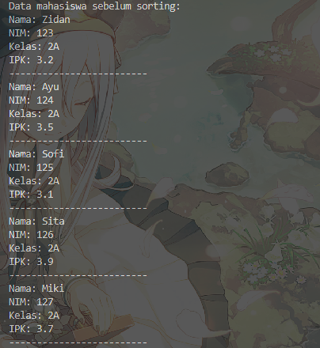

|            | Algorithm and Data Structure                                              |
| ---------- | ------------------------------------------------------------------------- |
| NIM        | 244107020028                                                              |
| Nama       | Muhammad Aryatama Mukapraja                                               |
| Kelas      | TI - 1H                                                                   |
| Repository | [link] (https://github.com/MuhammadAryatamaM/Algoritma-dan-Struktur-Data) |

# Jobhseet #5 Sorting (Bubble, Selection, dan Insertion Sort)

## Percobaan 1: Mengimplementasikan Sorting Menggunakan Object

### 6.2.2. Verifikasi Hasil Percobaan: Bubble Sort

Berikut hasil screenshot dari `SortingMain15.java`:


### 6.2.3. Verifikasi Hasil Percobaan: Selection Sort

Berikut hasil screenshot dari `SortingMain15.java`:


### 6.2.4. Verifikasi Hasil Percobaan: Insertion Sort

Berikut hasil screenshot dari `SortingMain15.java`:


### 6.2.5 Jawaban Pertanyaan

1. Jelaskan fungsi kode program berikut
   ```
   if (data[j - 1] > data[j]) {
      temp = data[j];
      data[j] = data[j - 1];
      data[j - 1] = temp;
   }
   ```
   Jawab: Jika ditemukan data yang di sebelah kirinya lebih besar, maka data tersebut akan langsung bertukar tempat
2. Tunjukkan kode program yang merupakan algoritma pencarian nilai minimum pada
   selection sort! <p>
   Jawab:

   ```
   int min = i;
   for (int j = i + 1; j < jumData; j++) {
      if (data[j] < data[min]) {
         min = j;
      }
   }
   ```

3. Pada Insertion sort , jelaskan maksud dari kondisi pada perulangan `while (j >= 0 && data[j] > temp)` <p>
   Jawab: Untuk menentukan kapan data itu tetap digeser atau tidak. Jika data yang ingin disisipkan (`temp`) lebih kecil dari yang di bagian kiri (`j`) maka perulangan akan tetap dilakukan sampai data sudah di paling kiri atau `j` lebih kecil dari `temp`
4. Pada Insertion sort, apakah tujuan dari perintah `data[j + 1] = data[j];`<p>
   Jawab: Menukar data sebelah kiri untuk ditempati ke sebelah kanannya

## Percobaan 2: Sorting Menggunakan Array of Object

### 6.3.3. Verifikasi Hasil Percobaan: Bubble Sort

Berikut hasil screenshot dari `MahasiswaDemo15.java`:

 <br>


### 6.3.4. Jawaban Pertanyaan

1. Perhatikan perulangan di dalam bubbleSort() di bawah ini:
   ```
   for (int i = 0; i < listMhs.length - 1; i++) {
      for (int j = 1; j < listMhs.length - i; j++) {
   ```
   a. Mengapa syarat dari perulangan `i` adalah `i < listMhs.length - 1` ? <br>
   Jawab: Karena perulangan `i` mengatur ada berapa tahap perulangan saat sorting, yaitu jumlah data dikurangi 1 <br>
   b. Mengapa syarat dari perulangan `j` adalah `j < listMhs.length - i` ? <br>
   Jawab: Karena perulangan `j` mengatur ada berapa kali perulangan untuk menukar angka, dengan tiap tahap yang dilewati, perulangan dalam menukar dikurangi sebesar banyak tahap sorting <br>
   c. Jika banyak data di dalam `listMhs` adalah 50, maka berapakali perulangan `i` akan berlangsung? Dan ada berapa **Tahap** bubble sort yang ditempuh? <br>
   Jawab: Ada 49 perulangan, yaitu 49 tahap dengan 49 + 48 + ... + 1 langkah <br>
2. Modifikasi program diatas dimana data mahasiswa bersifat dinamis (input dari keyboard) yang terdiri dari nim, nama, kelas, dan ipk! <p>
   Jawab: Di `MahasiswaBerprestasi15.java`, hapus fungsi `tambah()` dan buat fungsi `tambahData()` :
   ```
   void tambahData() {
      for (int i = 0; i < listMhs.length; i++) {
         System.out.printf( "======= MAHASISWA KE-%d =======\n", (i+1));
         System.out.print("Nama  : ");
         String nama = sc.nextLine();
         System.out.print("NIM   : ");
         String nim = sc.nextLine();
         System.out.print("Kelas : ");
         String kelas = sc.nextLine();
         System.out.print("IPK   : ");
         double ipk = sc.nextDouble();
         System.out.println();
         sc.nextLine();
         listMhs[i] = new Mahasiswa15(nim, nama, kelas, ipk);
      }
   }
   ```
   Lalu di `MahasiswaDemo15.java`, hapus instansiasi objek dan line `list.tambah()`, diganti `list.tambahData()`

### 6.3.6. Verifikasi Hasil Percobaan: Selection Sort

Berikut hasil screenshot dari `MahasiswaDemo15.java`:

 <br>


### 6.3.7. Jawaban Pertanyaan

1. Di dalam method selection sort, terdapat baris program seperti di bawah ini:
   ```
   int idxMin = i;
   for (int j = i + 1; j < listMhs.length; j++) {
      if (listMhs[j].ipk < listMhs[idxMin].ipk) {
         idxMin = j;
      }
   }
   ```
   Untuk apakah proses tersebut, jelaskan! <p>
   Jawab: Menentukan data terkecil sementara di index `i`, lalu lakukan perulangan dari data di kanan setelahnya (`i + 1`) sampai data terakhir. Jika ada data setelahnya yang lebih kecil dari data di index `i` tadi, maka index tadi ditukar dengan dindex `j` (terkecil sekarang)

### 6.3.9. Verifikasi Hasil Percobaan: Insertion Sort

Berikut hasil screenshot dari `MahasiswaDemo15.java`:

 <br>


### 6.3.10. Jawaban Pertanyaan

1. Ubahlah fungsi pada `InsertionSort` sehingga fungsi ini dapat melaksanakan proses sorting dengan cara descending.<p>
   Jawab:
   ```
   void insertionSort() {
      for (int i = 1; i < listMhs.length; i++) {
         Mahasiswa15 temp = listMhs[i];
         int j = i;
         while (j > 0 && listMhs[j - 1].ipk < temp.ipk) {
            listMhs[j] = listMhs[j - 1];
            j--;
         }
         listMhs[j] = temp;
      }
   }
   ```

## 6.4.1. Solusi Latihan Praktikum Dosen

Solusi ada di `Dosen15.java`, `DataDosen15.java`, dan `MainDosen15.java`, dan berikut screenshot hasilnya

 <br>
 <br>
 <br>
 <br>
 <br>
 <br>

**Penjelasan singkat:**

#### Pada Dosen15.java ada 2 langkah utama:

1. Deklarasi atribut dan buat konstruktor berparameter untuk tiap atribut
2. Untuk method `tampil`: Menampilkan seluruh atribut

#### Pada DataDosen15.java ada 5 langkah utama:

1. Deklarasi array `dataDosen` berukuran `10` dan variabel `idx = 0`
2. Untuk method `tambah`: Mengambil parameter dengan objek `Dosen15` yang akan disimpan ke array `dataDosen` dengan `idx++` di akhir
3. Untuk method `tampil`: Mencetak tiap objek dengan menjalankan `tampil` sesuai yang di kelas `Dosen15`
4. Untuk method `bubbleSort`: Mengurutkan data secara ascending dengan menukar 2 angka dari yang pertama hingga terakhir, yang tidak cocok akan ditukar secara berulang sampai selesai
5. Untuk method `insertionSort`: Mengurutkan data secara descending dengan menyelipkan angka yang dari data tidak terurut ke data terurut yang tepat tempatnya

#### Pada MainDosen15.java ada 3 langkah utama:

1. Instansiasi objek `list` bertipe `dataDosen15`
2. Membuat objek baru bertipe `Dosen15` dengan konstruktor berparameter serta ditambah ke array dengan fungsi `tambah` yang sudah dibuat
3. Panggil fungsi `tampil`, `bubbleSort`, dan `insertionSort`
