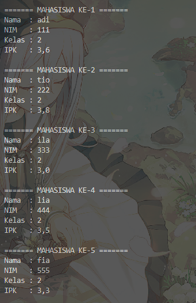
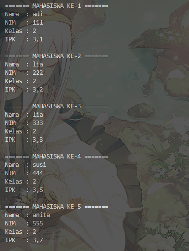
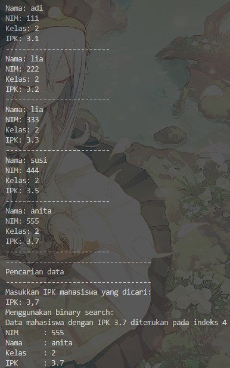
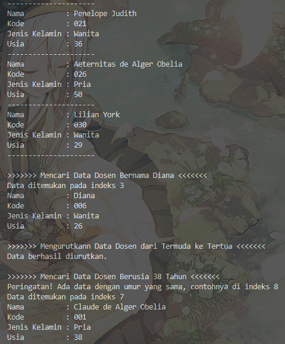

|            | Algorithm and Data Structure                                              |
| ---------- | ------------------------------------------------------------------------- |
| NIM        | 244107020028                                                              |
| Nama       | Muhammad Aryatama Mukapraja                                               |
| Kelas      | TI - 1H                                                                   |
| Repository | [link] (https://github.com/MuhammadAryatamaM/Algoritma-dan-Struktur-Data) |

# Jobhseet #6 Searching

## Percobaan 1: Searching / Pencarian Menggunakan Agoritma Sequential Search

### 6.2.2. Verifikasi Hasil Percobaan

Berikut hasil screenshot dari `MahasiswaDemo15.java`:

 <br>


### 6.2.3 Jawaban Pertanyaan

1. Jelaskan perbedaan method **`tampilDataSearch`** dan **`tampilPosisi`** pada class `MahasiswaBerprestasi`! <p>
   Jawab: `tampilDataSearch` menampilkan seluruh atribut (nim, nama, kelas, ipk) dari hasil search, `tampilPosisi` menampilkan posisi indeks dari hasil search
2. Jelaskan fungsi **`break`** pada kode program dibawah ini! <p>

   ```
   if (listMhs[j].ipk == cari) {
      posisi = j;
      break;
   }
   ```

   Jawab: Menghentikan proses pencarian jika sudah ketemu hasil yang cocok

## Percobaan 2: Searching / Pencarian Menggunakan Binary Search

### 6.3.2. Verifikasi Hasil Percobaan

Berikut hasil screenshot dari `MahasiswaDemo15.java`:

 <br>


### 6.3.3. Jawaban Pertanyaan

1. Tunjukkan pada kode program yang mana proses divide dijalankan! <p>
   Jawab:
   ```
   if (right >= left) {
      mid = (left + right) / 2;
      ...
      } else if (listMhs[mid].ipk < cari) {
         return findBinarySearch(cari, left, mid - 1);
      } else {
         return findBinarySearch(cari, mid + 1, right);
      }
   }
   ```
2. Tunjukkan pada kode program yang mana proses conquer dijalankan! <p>
   Jawab:
   ```
   if (cari == listMhs[mid].ipk) {
      return mid;
   }
   ```
3. Jika data IPK yang dimasukkan tidak urut. Apakah program masih dapat berjalan? Mengapa demikian! <p>
   Jawab: Program tidak bisa berjalan seperti semestinya karena binary search mengandalkan data yang terurut untuk mencari apakah bagian yang dibagi diambil bagian kanan atau bagian kiri
4. Jika IPK yang dimasukkan dari IPK terbesar ke terkecil (misal : 3.8, 3.7, 3.5, 3.4, 3.2) dan elemen yang dicari adalah 3.2. Bagaimana hasil dari binary search? Apakah sesuai? Jika tidak sesuai maka ubahlah kode program binary seach agar hasilnya sesuai <p>
   Jawab: Data tidak ditemukan dan error ArrayOutOfBound karena jika tidak ada datanya maka akan direturn `-1`, untuk data descending:

   ```
   int findBinarySearch(double cari, int left, int right) {
      int mid;
      if (right >= left) {
         mid = (left + right) / 2;
         if (cari == listMhs[mid].ipk) {
            return mid;
         } else if (listMhs[mid].ipk < cari) {
            return findBinarySearch(cari, left, mid - 1);
         } else {
            return findBinarySearch(cari, mid + 1, right);
         }
      }
      return -1;
   }
   ```

5. Modifikasilah program diatas yang mana jumlah mahasiswa yang di inputkan sesuai dengan masukan dari keyboard. <p>
   Jawab: Di `MahasiswaDemo15.java`:

   ```
   System.out.print("Masukkan jumlah mahasiswa: ");
   int jumMhs = sc.nextInt();
   MahasiswaBerprestasi15 list = new MahasiswaBerprestasi15(jumMhs);
   ```

   Di `MahasiswaBerprestasi15.java`:

   ```
   public MahasiswaBerprestasi15(int n) {
      listMhs = new Mahasiswa15[n];
   }

   Mahasiswa15[] listMhs;
   ```

## 6.4.1. Solusi Latihan Praktikum Dosen

Solusi ada di `Dosen15.java`, `DataDosen15.java`, dan `MainDosen15.java`, dan berikut screenshot hasilnya

 <br>
 <br>

**Penjelasan singkat:**

#### Pada Dosen15.java ada 2 langkah utama:

1. Deklarasi atribut dan buat konstruktor berparameter untuk tiap atribut
2. Untuk method `tampil`: Menampilkan seluruh atribut

#### Pada DataDosen15.java ada 7 langkah utama:

1. Deklarasi array `dataDosen` berukuran `10` dan variabel `idx = 0`
2. Untuk method `tambah`: Mengambil parameter dengan objek `Dosen15` yang akan disimpan ke array `dataDosen` dengan `idx++` di akhir
3. Untuk method `tampil`: Mencetak tiap objek dengan menjalankan `tampil` sesuai yang di kelas `Dosen15`
4. Untuk method `bubbleSort`: Mengurutkan data secara ascending dengan menukar 2 angka dari yang pertama hingga terakhir, yang tidak cocok akan ditukar secara berulang sampai selesai
5. Untuk method `tampilData`: Menampilkan seluruh isi atribut objek
6. Untuk method `pencarianDataSequential`: Mengecek tiap indeks array, jika ada nilai yang sesuai dengan yang dicari, maka return posisi indeks tersebut
7. Untuk method `pencarianDataBinary`: Mengecek indeks tengah dulu, jika nilai mid cocok dengan yang dicari, return posisi mid (sebelumnya itu, jika indeks sebelum atau sesudah mid nilainya sama, maka tampilkan peringatan). Jika tidak, apabila nilai yang dicari lebih kecil dari mid, maka ambil bagian kiri, dengan sebaliknya untuk bagian kanan. Hal ini dilakukan secara rekursif sampai ketemu nilai mid yang cocok dengan yang dicari atau tidak ditemukan data

#### Pada MainDosen15.java ada 4 langkah utama:

1. Instansiasi objek `list` bertipe `dataDosen15`
2. Membuat objek baru bertipe `Dosen15` dengan konstruktor berparameter serta ditambah ke array dengan fungsi `tambah` yang sudah dibuat
3. Panggil fungsi `tampil` dan masukkan parameter untuk fungsi `pencarianDataSequential`, yang akan return indeks hasil dan ditampilkan di `tampilData`
4. Mengurutkan data dengan `bubbleSort` dan masukkan parameter untuk fungsi `pencarianDataBinary`, yang akan return indeks hasil dan ditampilkan di `tampilData`
