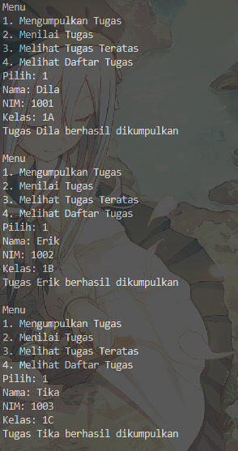
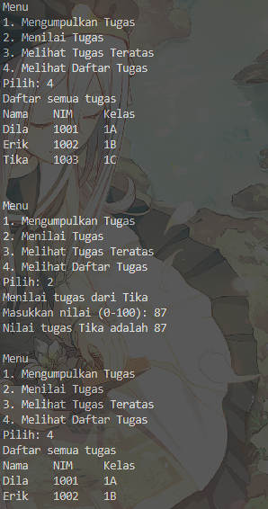
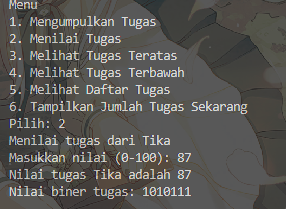
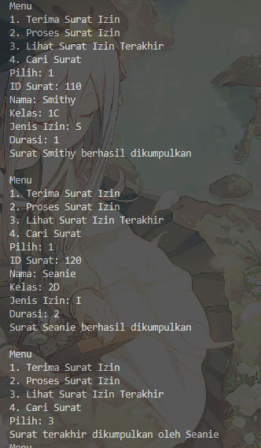
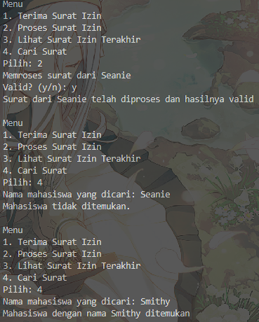

|            | Algorithm and Data Structure                                              |
| ---------- | ------------------------------------------------------------------------- |
| NIM        | 244107020028                                                              |
| Nama       | Muhammad Aryatama Mukapraja                                               |
| Kelas      | TI - 1H                                                                   |
| Repository | [link] (https://github.com/MuhammadAryatamaM/Algoritma-dan-Struktur-Data) |

# Jobhseet #9 Stack

## Percobaan 1: Mahasiswa Mengumpulkan Tugas

### 9.2.2. Verifikasi Hasil Percobaan

Berikut hasil screenshot dari `MahasiswaDemo15.java`:

 <br>


### 9.2.3 Jawaban Pertanyaan

1. Lakukan perbaikan pada kode program, sehingga keluaran yang dihasilkan sama dengan verifikasi hasil percobaan! Bagian mana yang perlu diperbaiki?! <p>
   Jawab:
   ```
    void print() {
        for (int i = top; i >= 0; i--) {
            System.out.println(stack[i].nama + "\t" + stack[i].nim + "\t" + stack[i].kelas);
        }
        System.out.println();
    }
   ```
2. Berapa banyak data tugas mahasiswa yang dapat ditampung di dalam Stack? Tunjukkan potongan kode programnya! <p>
   Jawab: Ada 5, dari potongan kode:

   ```
   StackTugasMahasiswa15 stack = new StackTugasMahasiswa15(5);
   ```

3. Mengapa perlu pengecekan kondisi **!isFull()** pada method **push**? Kalau kondisi if-else tersebut dihapus, apa dampaknya? <p>
   Jawab: Agar dicek dulu stacknya apakah sudah penuh atau tidak. Jika tidak ada pengecekan, data yang ditambah dan sudah melebihi kapasitas stack tidak bisa ditambah (Stack Overflow)

4. Modifikasi kode program pada class **MahasiswaDemo15** dan **StackTugasMahasiswa15** sehingga pengguna juga dapat melihat mahasiswa yang pertama kali mengumpulkan tugas melalui operasi lihat tugas terbawah! <p>
   Jawab: Di **StackTugasMahasiswa15**:
   ```
    public Mahasiswa15 tugasTerbawah() {
        if (!isEmpty()) return stack[0];
        else {
            System.out.println("Stack kosong! Tidak ada tugas yang dikumpulkan");
            return null;
        }
    }
   ```
   Di **MahasiswaDemo15**:
   ```
   Mahasiswa15 tengok = stack.tugasTerbawah();
   if (tengok != null) System.out.printf("Tugas pertama dikumpulkan oleh %s", tengok.nama);
   break;
   ```
5. Tambahkan method untuk dapat menghitung berapa banyak tugas yang sudah dikumpulkan saat ini, serta tambahkan operasi menunya! <p>
   Jawab: Di **StackTugasMahasiswa15**:
   ```
    public int jumlahTugas() {
        return top + 1;
    }
   ```
   Di **MahasiswaDemo15**:
   ```
    if (stack.jumlahTugas() == 0) System.out.println("Tidak ada tugas");
    else System.out.println("Jumlah tugas sekarang ada " + stack.jumlahTugas());
    break;
   ```

## Percobaan 2: Konversi Nilai Tugas ke Biner

### 9.3.2. Verifikasi Hasil Percobaan

Berikut hasil screenshot dari `MahasiswaDemo15.java`:



### 9.3.3. Jawaban Pertanyaan

1. Jelaskan alur kerja dari method **konversiDesimalKeBiner!** <p>
   Jawab: Tahap ini adalah tahap mendapatkan sisa dari tiap hasil pembagian 2 sampai `nilai` habis. Membuat objek baru `stack` dengan tipe data `StackKonversi15`. Memulai loop dengan syarat `nilai > 0`, mendapatkan `sisa` dari `nilai % 2`, lalu **push** `sisa` ke `stack`. Terakhir, update `nilai` dengan `nilai /= 2`. Tahap terakhir adalah tahap mengeluarkan stack dari atas ke bawah lalu disusun ke String satu per satu. Membuat objek baru `biner` dengan tipe data `String`. Memulai loop dengan syarat `stack` masih ada isinya, tambah tiap elemen **stack** ke String `biner` dengan **pop**. Return `biner`
2. Pada method konversiDesimalKeBiner, ubah kondisi perulangan menjadi while (nilai != 0), bagaimana hasilnya? Jelaskan alasannya! <p>
   Jawab: Hasilnya sama, tapi jika inputnya misal `-1`, maka nilai tersebut akan terus terbagi tanpa bisa memenuhi syaratnya `(nilai != 0)`

## 9.4.1. Solusi Latihan Praktikum Surat

Solusi ada di `Surat15.java`, `SuratStack15.java`, dan `SuratDemo15.java`, dan berikut screenshot hasilnya

 <br>
 <br>

**Penjelasan singkat:**

#### Pada Surat15.java ada 2 langkah utama:

1. Deklarasi atribut
2. Buat konstruktor default dan konstruktor berparameter dengan parameter tiap tribut

#### Pada SuratStack15.java ada 7 langkah utama:

1. Deklarasi array `tumpukanSurat` berukuran `10` dengan tipe data `Surat15` dan deklarasi `top = -1`
2. Untuk method `isEmpty`: Return boolean `top == -1`
3. Untuk method `isFull`: Return boolean `top == tumpukanSurat.length - 1`
4. Untuk method `push`: Jika stack tidak penuh, increment +1 `top` lalu masukkan objek `Surat15` ke `tumpukanSurat[top]`
5. Untuk method `pop`: Jika stack tidak kosong, simpan sementara objek yang ada di `tumpukanSurat[top]` ke `m`, lalu return `m`. Jika kosong, return `null`
6. Untuk method `peek`: Jika stack tidak kosong, return `tumpukanSurat[top]`. Jika kosong, return `null`
7. Untuk method `cariNama`: Jika stack tidak kosong, mulai perulangan untuk menjalankan linear search dan return objek yang atribut `namaMahasiswa` cocok dengan nama yang dicari. Jika kosong, return `null`

#### Pada SuratDemo15.java ada 5 langkah utama:

1. Instansiasi objek `stack` bertipe `StackSurat15` dan buat while loop untuk menu
2. Menu 1 (Terima Surat Izin): Input tiap atribut `Surat15` ke variabel lalu buat objek baru `srt` dengan parameter tiap atribut yang sudah diinput. Masukkan `srt` ke stack dengan **push(srt)**
3. Menu 2 (Proses Surat Izin): Ambil stack teratas dengan **pop()** dan simpan ke `diproses`. Jika `diproses != null`, input status valid atau tidak dan langsung di print
4. Menu 3 (Lihat Surat Izin Terakhir): Mengambil atribut `namaMahasiswa` dari stack teratas dengan **peek()**
5. Menu 4 (Cari Surat): Input nama yang ingin dicari, panggil **cariNama(nm)** lalu simpan hasilnya ke `cari`. Jika `cari =! null`, tampilkan namanya
